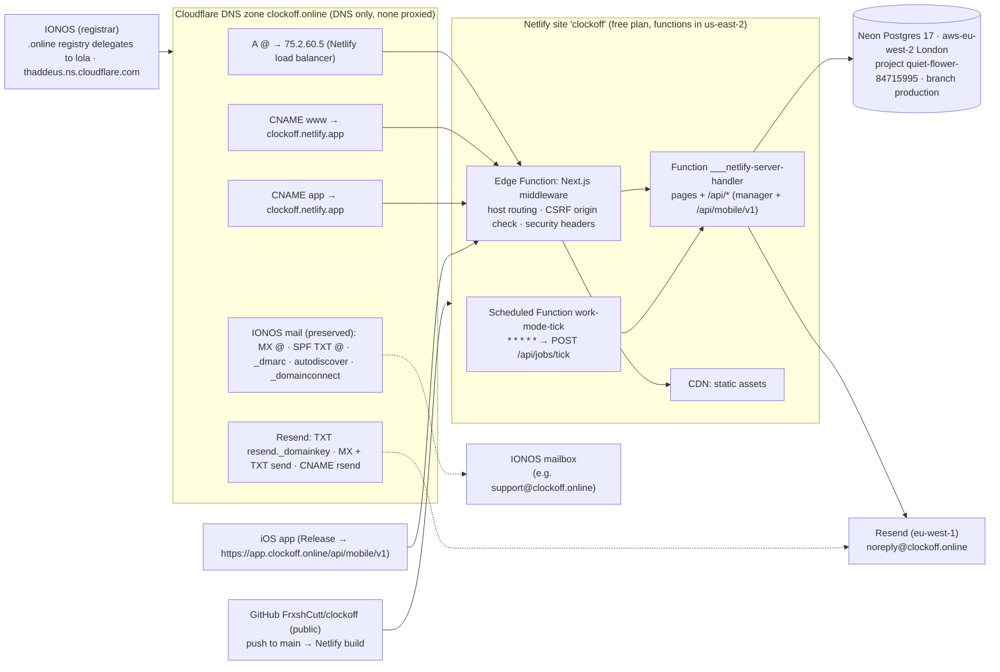

# Deployment

> **Status (2026-10-06): LIVE.** `https://clockoff.online` (marketing site), `https://www.clockoff.online`
> (301 → apex) and `https://app.clockoff.online` (dashboard and every API) are served by the Netlify site
> `clockoff` (`https://clockoff.netlify.app`; production deploys from `main`). One Let's Encrypt certificate covers
> all three names. It expires on 2027-01-04 and Netlify renews it automatically while the records point at Netlify.
>
> DNS for `clockoff.online` is a **Cloudflare** zone (free plan). The domain is still registered at IONOS and the
> mailbox is still at IONOS. Every record is **DNS only** (not proxied). All DNS changes go through the Cloudflare
> API — see [DNS record inventory](#dns-record-inventory) and `docs/DNS_RECORDS.md`.

## Hosting architecture



- **One Netlify site serves both sites.** With `HOST_ROUTING=on`, `src/middleware.ts` (an Edge Function) uses
  `src/server/http/hostRouting.ts`:
  - `www.clockoff.online` → 308 to `clockoff.online`. In production Netlify answers first: its own
    primary-domain redirect sends `www` to the apex with a 301, so this rule is a fallback.
  - `clockoff.online` serves the marketing pages, `/api/request-demo` and `/api/health`; dashboard and auth pages
    redirect to `app.clockoff.online`; any other `/api/*` returns 404, so session cookies only ever live on
    `app.clockoff.online`.
  - `app.clockoff.online` serves the dashboard, auth pages and every API; `/` redirects to `/overview`.
  - Any other host (`clockoff.netlify.app`, deploy previews, localhost) is served unchanged.
- **Background job:** `apps/web/netlify/functions/work-mode-tick.mts` is a Netlify Scheduled Function
  (`* * * * *`, 30-second limit) that POSTs `$APP_URL/api/jobs/tick` with `Authorization: Bearer $CRON_SECRET`.
  Scheduled functions only run on the published production deploy. Because it calls `$APP_URL`, it fails whenever
  `app.clockoff.online` does not resolve.
- **Access protection:** the Netlify account protects deploys with team login by default. The site is set to
  protect **non-production** contexts only (deploy previews, branch deploys); production is public.

### Known limitation: functions run in the US

The site is on Netlify's **free** plan, so its functions run in **US East (Ohio, `us-east-2`)** while the
database is in **London**. Every database query crosses the Atlantic (~70–80 ms per round trip), which makes
dashboard and API responses noticeably slower than they would be in one region, and employee data is processed
in the US under Netlify's Data Processing Agreement (stored in the UK by Neon). Each `work-mode-tick` run takes
3–5 s for the same reason.
**Remedy:** upgrade the Netlify team to Pro and set Site configuration → Functions → Region to **London
(`eu-west-2`)**, then redeploy. No code change is needed.

### Other platform limits (accepted for the MVP)

| Area                     | Behaviour on Netlify                                                                                                                                                                                                                                                                                                                                                           | Fix when it matters                                                                        |
| ------------------------ | ------------------------------------------------------------------------------------------------------------------------------------------------------------------------------------------------------------------------------------------------------------------------------------------------------------------------------------------------------------------------------ | ------------------------------------------------------------------------------------------ |
| Cold starts              | The first request after idle wakes both the function and Neon's auto-suspended compute (≈ 5–6 s observed).                                                                                                                                                                                                                                                                     | Neon paid plan (no suspend) and/or regular traffic; the minute job keeps the function warm |
| Request duration         | Netlify documents 60 s (not configurable; Next's `maxDuration` is ignored), but this site's streamed responses are cut at 30 s in practice. Nothing else in the app comes close.                                                                                                                                                                                               | —                                                                                          |
| Realtime dashboard (SSE) | The server closes each stream after 20 s with a `reconnect` control event: this site's streaming limit is 30 s in practice (Netlify's docs say 60 s) and the request's abort signal never fires there. The dashboard reconnects silently and refreshes realtime-backed data every 30 s; the event bus is per instance, so events raised elsewhere arrive through that refresh. | Redis pub/sub adapter for `EventBus`                                                       |
| Rate limiting            | `memory` backend is per instance — best effort. Client IPs come from `x-nf-client-connection-ip`.                                                                                                                                                                                                                                                                              | Redis rate limiter                                                                         |
| Silent pushes (APNs)     | Not configured. If enabled, `pushBridge`'s 5-second debounce timer may not fire in a frozen function.                                                                                                                                                                                                                                                                          | Send via `runAfterResponse` or a queue before enabling APNs                                |
| Native modules           | `@node-rs/argon2` and the Prisma engine are platform-specific. **Always build on Netlify** (Git-triggered); never `netlify deploy --build` from a Mac.                                                                                                                                                                                                                         | —                                                                                          |

## Build and continuous deployment

| Setting                            | Value                                                                                                                                   |
| ---------------------------------- | --------------------------------------------------------------------------------------------------------------------------------------- |
| Netlify site                       | `clockoff` (id `b65c1658-1110-42ec-a926-637ae7d9415f`, team `frxshcutt`, free plan)                                                     |
| Repository                         | `FrxshCutt/clockoff` (public), production branch `main`; renamed from `FrxshCutt/workmode` on 2026-10-07 (GitHub redirects the old URL) |
| How builds start                   | GitHub push webhook → Netlify; Netlify clones with a read-only deploy key on the repository                                             |
| Base directory / package directory | repo root / `apps/web` (`apps/web/netlify.toml`)                                                                                        |
| Build command                      | `pnpm --filter @clockoff/web run build:netlify` → `prisma generate` + `next build`                                                      |
| Publish directory                  | `apps/web/.next`                                                                                                                        |
| Functions directory                | `apps/web/netlify/functions`                                                                                                            |
| Runtime                            | `@netlify/plugin-nextjs` 5.16.2 (declared in `netlify.toml`, pinned in `apps/web` devDependencies)                                      |
| Node / pnpm                        | 22 / 11.10.0 (`[build.environment]`)                                                                                                    |
| Prisma                             | `binaryTargets = ["native", "rhel-openssl-3.0.x"]` (Lambda engine bundled into the server function)                                     |
| Custom domains                     | primary `clockoff.online`, aliases `www.clockoff.online`, `app.clockoff.online`; no Netlify DNS zone                                    |

## Environment variables (Netlify site, all contexts)

| Variable                                         | Value / origin                                                                                                                                                                |
| ------------------------------------------------ | ----------------------------------------------------------------------------------------------------------------------------------------------------------------------------- |
| `DATABASE_URL`                                   | Neon API — pooled connection (`ep-proud-bonus-za5wlmr7-pooler…eu-west-2.aws.neon.tech/clockoff`, `sslmode=require&pgbouncer=true&connect_timeout=15`). Copy in `.env.deploy`. |
| `APP_URL`, `NEXT_PUBLIC_APP_URL`                 | `https://app.clockoff.online`                                                                                                                                                 |
| `MARKETING_URL`                                  | `https://clockoff.online`                                                                                                                                                     |
| `HOST_ROUTING`                                   | `on`                                                                                                                                                                          |
| `CLIENT_IP_HEADER` / `TRUSTED_PROXY_HOPS`        | `x-nf-client-connection-ip` / `1`                                                                                                                                             |
| `SESSION_SECRET` (the "AUTH_SECRET" of this app) | 32 random bytes (base64), generated locally; copy in `.env.deploy`                                                                                                            |
| `MOBILE_JWT_SECRET` / `MOBILE_JWT_KEY_ID`        | 32 random bytes (base64) / `v1`                                                                                                                                               |
| `INTEGRATION_ENCRYPTION_KEY`                     | 32 random bytes (base64)                                                                                                                                                      |
| `CRON_SECRET`                                    | 32 random bytes (hex)                                                                                                                                                         |
| `SESSION_TTL_DAYS`                               | `14`                                                                                                                                                                          |
| `EMAIL_PROVIDER` / `EMAIL_FROM`                  | `resend` / `ClockOff <noreply@clockoff.online>`                                                                                                                               |
| `RESEND_API_KEY`                                 | supplied by the owner; copy in `.env.deploy`                                                                                                                                  |
| `REQUIRE_EMAIL_VERIFICATION`                     | not set → `true` in production (managers verify their email)                                                                                                                  |
| `JOBS_ENABLED`                                   | `false` (the scheduled function replaces the in-process runner)                                                                                                               |
| `DEV_TOOLS_ENABLED`                              | `false`                                                                                                                                                                       |
| `LOG_LEVEL` / `RATE_LIMIT_BACKEND`               | `info` / `memory`                                                                                                                                                             |

Change variables with the Netlify API (`PUT /api/v1/accounts/{account_id}/env/{key}?site_id=…`) or the UI, then
redeploy (Edge Functions and functions read them at runtime, `NEXT_PUBLIC_*` at build time).

### Deploy-time values (`.env.deploy` only, never on Netlify)

`.env.deploy` is a local, gitignored file that holds live credentials. The app never reads the values below. Do
not add them to Netlify.

| Variable        | Purpose                                                                                    |
| --------------- | ------------------------------------------------------------------------------------------ |
| `DIRECT_URL`    | Unpooled Neon connection, used for migrations                                              |
| `DNS_PROVIDER`  | `cloudflare`                                                                               |
| `DNS_ZONE_ID`   | Cloudflare zone id of `clockoff.online` (`e2bcea4df92e1b74449156c648c2cd78`, not a secret) |
| `DNS_API_TOKEN` | Cloudflare API token with Zone → DNS → Edit on `clockoff.online` only                      |

## Database (Neon)

|                  |                                                                                                                                   |
| ---------------- | --------------------------------------------------------------------------------------------------------------------------------- |
| Project          | `clockoff` (`quiet-flower-84715995`), organisation "ClockOff" (free plan)                                                         |
| Region / version | `aws-eu-west-2` (London) / Postgres 17                                                                                            |
| Branch           | `production` (`br-summer-band-zamyb83w`, default)                                                                                 |
| Database / role  | `clockoff` / `clockoff`                                                                                                           |
| Endpoints        | pooled `ep-proud-bonus-za5wlmr7-pooler.c-2.eu-west-2.aws.neon.tech`, direct `ep-proud-bonus-za5wlmr7.c-2.eu-west-2.aws.neon.tech` |

- **Migrations** run from a trusted machine against the direct endpoint:

  ```bash
  cd packages/db
  DATABASE_URL="$DIRECT_URL" pnpm exec prisma migrate deploy   # DIRECT_URL from .env.deploy
  ```

  Never use `migrate dev`, `migrate reset` or `db push` against production. `GET /api/health` returns
  `migrations: "up_to_date" | "pending" | "failed"` and a 503 unless everything is applied.

- **Seed:** never. The seed refuses `NODE_ENV=production` and any non-local database unless `ALLOW_SEED=true`.
- **First account:** register at `https://app.clockoff.online/register`; the first user creates the organisation
  and becomes OWNER. The production database was left empty.

### Backups and restore

Neon keeps point-in-time history of the branch. On the free plan the **restore window is 6 hours**
(`history_retention_seconds = 21600`); paid plans keep 7–30 days. There are no other automatic backups.

To restore:

1. Neon console → project `clockoff` → **Restore** → pick a time within the window, or via the API:
   `POST /api/v2/projects/quiet-flower-84715995/branches` with `{"branch": {"parent_id": "br-summer-band-zamyb83w", "parent_timestamp": "<ISO time>"}}`.
2. Inspect the restored branch through its own connection string.
3. Either restore the `production` branch in place from the console, or point `DATABASE_URL` on Netlify at the
   restored branch and redeploy.

Recommended until on a paid plan: a nightly `pg_dump "$DIRECT_URL" | gzip` to private storage.

## Email (Resend)

- `ResendEmailProvider` (`apps/web/src/server/email`) sends through Resend's HTTP API when `EMAIL_PROVIDER=resend`;
  development keeps `ConsoleEmailProvider`. Verification, password-reset, manager-invite and employee-invite emails
  all go through it.
- Sending domain `clockoff.online` (Resend id `538d0ad9-2bee-472e-9b12-36eff396662d`, region `eu-west-1`, sending
  only), from `ClockOff <noreply@clockoff.online>`. Resend only delivers once its DNS records verify.
- **Domain verification: verified.** Requested at about 20:57 UTC on 2026-10-06; Resend reported the domain and all four records verified when checked at 22:39 UTC.
- **SPF path: subdomain.** Resend's required records put SPF on `send.clockoff.online` (MX
  `feedback-smtp.eu-west-1.amazonses.com` and TXT `v=spf1 include:amazonses.com ~all`), plus the `rsend` CNAME
  and the DKIM key on `resend._domainkey`. Resend does not need SPF at the apex, so the apex SPF
  (`v=spf1 include:_spf-eu.ionos.com ~all`, for the IONOS mailbox) was left untouched. Nothing was merged.
- **DMARC: no change.** Resend's required-record list has no DMARC record. The existing `_dmarc` CNAME → IONOS
  (`v=DMARC1; p=none;`) stays and meets Resend's recommendation to have a DMARC policy. If the owner later wants
  aggregate reports, replace that single CNAME with **one** TXT record (for example
  `v=DMARC1; p=none; rua=mailto:support@clockoff.online`): back up, delete the CNAME, then create the TXT. Never
  add a second `_dmarc` record. This is optional.

## Redeploy, roll back

- **Redeploy:** push to `main`. To rebuild without a commit:
  `curl -X POST -H "Authorization: Bearer $NETLIFY_AUTH_TOKEN" https://api.netlify.com/api/v1/sites/b65c1658-1110-42ec-a926-637ae7d9415f/builds`.
- **Roll back:** Netlify keeps every deploy. Publish an earlier one:
  `curl -X POST -H "Authorization: Bearer $NETLIFY_AUTH_TOKEN" https://api.netlify.com/api/v1/sites/b65c1658-1110-42ec-a926-637ae7d9415f/deploys/<DEPLOY_ID>/restore`
  (or Netlify UI → Deploys → pick one → "Publish deploy"). Migrations are forward-only: reverse a bad one with a
  new migration, or restore the database branch.
- **Schema changes:** run the (additive) migration first, then push the code that uses it.

## DNS record inventory

Authoritative DNS is the Cloudflare zone `clockoff.online` (zone id `e2bcea4df92e1b74449156c648c2cd78`, status
`active`, nameservers `lola.ns.cloudflare.com` and `thaddeus.ns.cloudflare.com`). The registrar is still IONOS.
The zone holds 13 records. All have TTL auto and none is proxied. Full values, including the DKIM key, and the
step-by-step runbook are in **`docs/DNS_RECORDS.md`**.

| Type  | Name                | Content                                           | Purpose                                           | Origin       |
| ----- | ------------------- | ------------------------------------------------- | ------------------------------------------------- | ------------ |
| A     | `@`                 | `75.2.60.5`                                       | Netlify load balancer → marketing site            | deploy       |
| CNAME | `www`               | `clockoff.netlify.app`                            | Netlify; 301 to the apex                          | deploy       |
| CNAME | `app`               | `clockoff.netlify.app`                            | Netlify; dashboard and every `/api/*` route       | deploy       |
| TXT   | `resend._domainkey` | `p=MIGfMA0…` (public key)                         | Resend DKIM                                       | deploy       |
| MX    | `send`              | `feedback-smtp.eu-west-1.amazonses.com` (prio 10) | Resend bounce/feedback (envelope sender)          | deploy       |
| TXT   | `send`              | `v=spf1 include:amazonses.com ~all`               | Resend SPF on the sending subdomain               | deploy       |
| CNAME | `rsend`             | `send.forge.rmta.net`                             | Resend return-path/tracking                       | deploy       |
| MX    | `@`                 | `mx00.ionos.co.uk` (prio 10)                      | IONOS mailbox — **preserve**                      | IONOS import |
| MX    | `@`                 | `mx01.ionos.co.uk` (prio 10)                      | IONOS mailbox — **preserve**                      | IONOS import |
| TXT   | `@`                 | `v=spf1 include:_spf-eu.ionos.com ~all`           | SPF for IONOS mail — **preserve** (only apex SPF) | IONOS import |
| CNAME | `_dmarc`            | `dmarc.ionos.co.uk` (→ `v=DMARC1; p=none;`)       | DMARC policy (IONOS) — keep                       | IONOS import |
| CNAME | `autodiscover`      | `adsredir.ionos.info`                             | IONOS mail client autoconfig — keep               | IONOS import |
| CNAME | `_domainconnect`    | `_domainconnect.ionos.com`                        | IONOS Domain Connect — keep                       | IONOS import |

- The 7 "deploy" records were created through the Cloudflare API on 2026-10-06 (~20:55 UTC). Each carries a
  Cloudflare `comment` that describes it.
- The owner deleted the old IONOS parking records (apex A `217.160.0.186`, AAAA `2001:8d8:100f:f000::200`)
  before the move. Netlify needs no AAAA record.
- **Pre-change backup:** `docs/dns-backup-20261006T205519Z.json` — the 6 original records as a verbatim
  Cloudflare API export. It is excluded from Prettier so it stays byte-for-byte. After the change the 6 originals
  were re-read and are identical (same ids, content, priority, proxied flag).
- **Backup rule:** before any edit or delete, dump the full record set to
  `docs/dns-backup-<UTC timestamp>.json` and commit it.

### Changing DNS

- Make every change through the **Cloudflare API**. Do not edit records by hand at IONOS: IONOS is now only the
  registrar and the mailbox host, and its DNS panel is not authoritative.
- Credentials: a Cloudflare API token with **Zone → DNS → Edit** on `clockoff.online`, kept in `.env.deploy` as
  `DNS_API_TOKEN`, with `DNS_ZONE_ID` and `DNS_PROVIDER=cloudflare`. It is a deploy-time credential only. It is
  not a Netlify environment variable and the app never reads it.
- Rules:
  - Always `"proxied": false` (DNS only). Cloudflare proxying breaks Netlify's Let's Encrypt issuance and mail
    lookups.
  - Never modify or delete the MX records or the apex SPF TXT. Keep one SPF TXT at the apex and one `_dmarc`
    record only.
  - Back up before any destructive call (see the backup rule above). The export command is in
    [`docs/DNS_RECORDS.md` §5.3](DNS_RECORDS.md#53-back-up).
- Commands (`$CF_API_TOKEN` and `$CF_ZONE_ID` are the `DNS_API_TOKEN` and `DNS_ZONE_ID` values from
  `.env.deploy`):

  ```bash
  # List every record (also the source for a backup)
  curl -s -H "Authorization: Bearer $CF_API_TOKEN" \
    "https://api.cloudflare.com/client/v4/zones/$CF_ZONE_ID/dns_records?per_page=100"

  # Create
  curl -s -X POST -H "Authorization: Bearer $CF_API_TOKEN" -H "Content-Type: application/json" \
    "https://api.cloudflare.com/client/v4/zones/$CF_ZONE_ID/dns_records" \
    --data '{"type":"CNAME","name":"x.clockoff.online","content":"…","ttl":1,"proxied":false,"comment":"…"}'

  # Edit / delete (back up first: docs/DNS_RECORDS.md §5.3)
  #   PATCH  /zones/$CF_ZONE_ID/dns_records/{record_id}
  #   DELETE /zones/$CF_ZONE_ID/dns_records/{record_id}
  ```

- Restore from a backup: re-create each record in the backup's `records[]` with its type, name, content, TTL,
  priority and proxied flag.

## Production verification (2026-10-06)

Checked between 20:43 and 21:17 UTC after the DNS move (`curl -I` at 21:05 UTC).

| Check                                                      | Result                                                                                                                                                                                                                                                                                                                                                                                                                                                                                                                                                                            |
| ---------------------------------------------------------- | --------------------------------------------------------------------------------------------------------------------------------------------------------------------------------------------------------------------------------------------------------------------------------------------------------------------------------------------------------------------------------------------------------------------------------------------------------------------------------------------------------------------------------------------------------------------------------- |
| Delegation                                                 | `.online` registry delegates to `lola.ns.cloudflare.com` and `thaddeus.ns.cloudflare.com`; zone `active`                                                                                                                                                                                                                                                                                                                                                                                                                                                                          |
| TLS certificate                                            | Issued ~5 min after the request: Let's Encrypt, CN `clockoff.online`, SAN apex/`www`/`app`, valid until 2027-01-04                                                                                                                                                                                                                                                                                                                                                                                                                                                                |
| `curl -I https://clockoff.online/`                         | 200, marketing page (title "Work Mode · Automatically create distraction-free shifts.")                                                                                                                                                                                                                                                                                                                                                                                                                                                                                           |
| `curl -I https://www.clockoff.online/`                     | 301 → `https://clockoff.online/` (Netlify primary-domain redirect)                                                                                                                                                                                                                                                                                                                                                                                                                                                                                                                |
| `curl -I https://app.clockoff.online/`                     | 307 → `/overview` (middleware); `/login` renders "Sign in to Work Mode"                                                                                                                                                                                                                                                                                                                                                                                                                                                                                                           |
| `curl -I http://…` (all three hosts)                       | 301 → `https://` (Netlify)                                                                                                                                                                                                                                                                                                                                                                                                                                                                                                                                                        |
| Cross-host routing                                         | Apex `/login` and `/overview` → 308 to app; app `/pricing` → 308 to apex; apex `/api/mobile/v1/me` → 404                                                                                                                                                                                                                                                                                                                                                                                                                                                                          |
| `GET /api/health` (app and apex)                           | `{"status":"ok","database":"ok","migrations":"up_to_date","time":"…"}`                                                                                                                                                                                                                                                                                                                                                                                                                                                                                                            |
| Bogus join lookup (`POST /api/mobile/v1/join/lookup`, app) | Well-formed unknown code → 404 `INVALID_COMPANY_CODE`; unknown body key → 400 `VALIDATION_ERROR` with field details; malformed JSON → 400 "Body is not valid JSON"                                                                                                                                                                                                                                                                                                                                                                                                                |
| Security headers (apex and app)                            | `Content-Security-Policy`, `Strict-Transport-Security: max-age=63072000; includeSubDomains` (from `apps/web/src/server/http/securityHeaders.ts`), `X-Frame-Options: DENY`, `X-Content-Type-Options: nosniff`, `Referrer-Policy: strict-origin-when-cross-origin`, `Permissions-Policy`, `Cross-Origin-Opener-Policy: same-origin`, `x-request-id`                                                                                                                                                                                                                                 |
| Function logs: `work-mode-tick`                            | Before DNS resolved: failed every minute with a DNS lookup `TypeError` (Netlify retried each run ~3×). Since 21:01 UTC: succeeds once per minute, 3–5 s per run, no errors                                                                                                                                                                                                                                                                                                                                                                                                        |
| Function logs: server handler                              | No errors                                                                                                                                                                                                                                                                                                                                                                                                                                                                                                                                                                         |
| Mail records                                               | Apex MX and apex SPF resolve unchanged from public resolvers; the 6 original zone records are identical after the change                                                                                                                                                                                                                                                                                                                                                                                                                                                          |
| Test email to support@clockoff.online                      | ✅ Sent through the Resend API from `noreply@clockoff.online` at 22:40 UTC; Resend reported `delivered` 5 s later (accepted by the IONOS mailbox).                                                                                                                                                                                                                                                                                                                                                                                                                                |
| Throwaway manager registration end to end                  | ✅ 22:41 UTC, as `delivered@resend.dev` (Resend’s test inbox). `POST /api/auth/register` → 201 with `requiresEmailVerification: true`. The user row and one verification token appeared in the production database. The app sent "Confirm your Work Mode email" through Resend, which reported it `delivered`. Following its link (`/verify-email` 200, `POST /api/auth/verify-email` 200) set `emailVerifiedAt`, and sign-in then returned 200 with a session. The account was deleted (its session and token cascade) and all 38 application tables were confirmed empty again. |

## Production verification after the rename (2026-10-07)

Deploy `6ac60ee16c8952000854cb9b` (commit `f720667`, published 09:22 UTC) is the first build named ClockOff. The
2026-10-06 table above is the record from before the rename and is kept as it was observed.

| Check                               | Result                                                                                                                                                                                                                                                                                                                          |
| ----------------------------------- | ------------------------------------------------------------------------------------------------------------------------------------------------------------------------------------------------------------------------------------------------------------------------------------------------------------------------------- |
| `https://clockoff.online/`          | `<title>ClockOff · Automatically create distraction-free shifts.</title>`; `application-name` and `og:site_name` are ClockOff. The remaining "Work Mode" on the page is the shift state ("Work Mode switches on when a scheduled shift starts").                                                                                |
| `https://app.clockoff.online/login` | `Sign in · ClockOff`, heading "Sign in to ClockOff". `/overview` is titled `Overview · ClockOff`.                                                                                                                                                                                                                               |
| `GET /api/health`                   | `{"status":"ok","database":"ok","migrations":"up_to_date",…}`; security headers present.                                                                                                                                                                                                                                        |
| Email                               | A throwaway registration (`delivered@resend.dev`, deleted afterwards) received "Confirm your ClockOff email" from `ClockOff <noreply@clockoff.online>`, body "…finish setting up your ClockOff account.", Resend status `delivered`. Every table's row count was identical before and after, so the owner's data was untouched. |
| Netlify `EMAIL_FROM`                | Changed from `Work Mode <noreply@clockoff.online>` to `ClockOff <noreply@clockoff.online>` via the API before the deploy.                                                                                                                                                                                                       |
| Function logs                       | No warnings or errors since the deploy; server logs carry `service: "clockoff-web"` (older lines with `workmode-web` all predate the publish time).                                                                                                                                                                             |

## iOS

Release builds call `https://app.clockoff.online/api/mobile/v1` (`apps/ios/Config/Release.xcconfig`,
`API_BASE_URL`, enforced by `Scripts/verify-release.sh`); Debug calls `http://localhost:3000/api/mobile/v1`.
