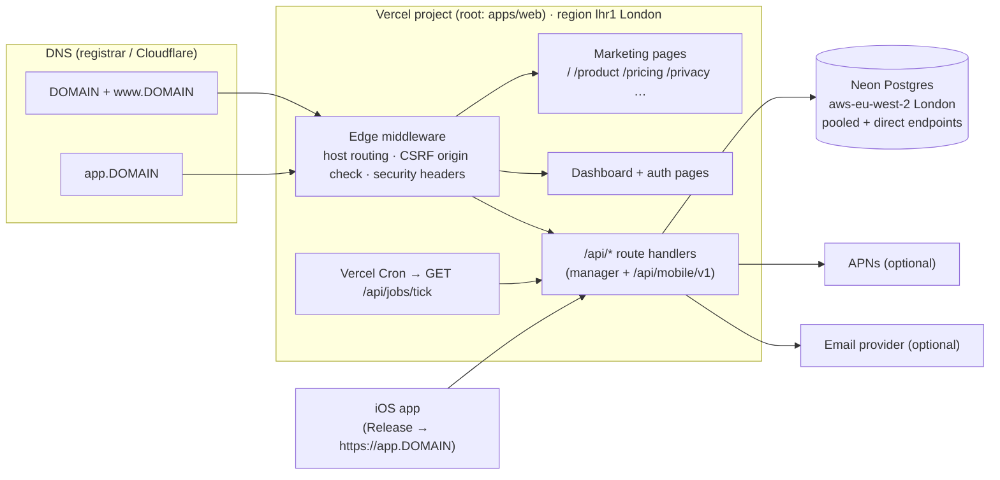

# Deployment

> **Status: not deployed yet.** The repository is prepared for production (this runbook, hostname routing,
> Vercel build config, cron endpoint, health check with migration status, seed guard). Provisioning is
> waiting for credentials in `.env.deploy` — see "What is still manual" below. Sections marked _(filled in at
> deploy time)_ are completed by the deployment run.

## Hosting architecture



- **One Vercel deployment serves both sites.** With `HOST_ROUTING=on`, `src/middleware.ts` uses
  `src/server/http/hostRouting.ts`:
  - `www.DOMAIN` → 308 to `DOMAIN` (same path).
  - `DOMAIN` serves the marketing pages, `/api/request-demo` and `/api/health`. Dashboard and auth pages
    redirect (308) to `app.DOMAIN`. Any other `/api/*` returns 404, so session cookies are only ever set on
    `app.DOMAIN`.
  - `app.DOMAIN` serves the dashboard, auth pages and every API. `/` redirects to `/overview`, and marketing
    paths redirect to `DOMAIN`.
  - Any other host (`*.vercel.app` preview URLs, localhost) is served unchanged.
- **Data stays in the UK/EU:** Vercel functions run in `lhr1` (London; set in `apps/web/vercel.json`) and the
  database is a Neon project in `aws-eu-west-2` (London).
- **Background job:** the minute-by-minute Work Mode tick (`docs/WORK_MODE_SERVER_JOB.md`) is triggered by
  Vercel Cron calling `GET /api/jobs/tick` with `Authorization: Bearer $CRON_SECRET`. Vercel's Hobby plan only
  allows daily cron jobs; per-minute scheduling needs the **Pro** plan, or an external scheduler that POSTs the
  same endpoint every minute (any HTTP cron service; GitHub Actions can only do every 5 minutes).

### Serverless caveats (known and accepted for the MVP)

| Area                     | Behaviour on Vercel                                                                                                                                                                                                                         | Fix when it matters                                                       |
| ------------------------ | ------------------------------------------------------------------------------------------------------------------------------------------------------------------------------------------------------------------------------------------- | ------------------------------------------------------------------------- |
| Realtime dashboard (SSE) | Streams are cut at the function's maximum duration and reconnect automatically. The event bus is per instance, so an event raised on another instance does not reach an open stream; the dashboard's 30-second polling fallback catches it. | Redis pub/sub adapter for `EventBus`                                      |
| Rate limiting            | `memory` backend is per instance — best effort.                                                                                                                                                                                             | Redis rate limiter (`RATE_LIMIT_BACKEND=redis`)                           |
| Silent pushes (APNs)     | `pushBridge` debounces per device with a 5-second timer; on serverless the function can be frozen before it fires, so a push may be skipped. Phones still re-sync on launch, foreground, background refresh and reconnect.                  | Send through `runAfterResponse`/`after()` or a queue before enabling APNs |
| Cron                     | Hobby plan: daily only.                                                                                                                                                                                                                     | Pro plan or an external per-minute scheduler                              |

## Build and install

`apps/web/vercel.json`:

| Setting         | Value                                                                           |
| --------------- | ------------------------------------------------------------------------------- |
| Root directory  | `apps/web` (Vercel project setting)                                             |
| Framework       | Next.js                                                                         |
| Install command | `pnpm install --frozen-lockfile` (pnpm installs the whole workspace)            |
| Build command   | `pnpm run build:vercel` → `pnpm --filter @workmode/db generate && next build`   |
| Node.js         | 22.x or 24.x (project setting; `.node-version` is 24)                           |
| pnpm            | 11 via `ENABLE_EXPERIMENTAL_COREPACK=1` (honours `package.json#packageManager`) |

The build needs no secrets: environment variables are validated lazily at first use. The production build was
verified locally with an empty environment.

## Environment variables

Every variable is documented in `apps/web/.env.production.example` and `docs/ENVIRONMENT.md`.

| Variable                                                                           | Source                                                                                    |
| ---------------------------------------------------------------------------------- | ----------------------------------------------------------------------------------------- |
| `DATABASE_URL`                                                                     | Neon API — pooled connection string (`-pooler` host, `sslmode=require&pgbouncer=true`)    |
| `DIRECT_URL`                                                                       | Neon API — direct connection string; used only for migrations, kept in `.env.deploy`      |
| `APP_URL`, `NEXT_PUBLIC_APP_URL`                                                   | `https://app.DOMAIN`                                                                      |
| `MARKETING_URL`                                                                    | `https://DOMAIN`                                                                          |
| `HOST_ROUTING`                                                                     | `on`                                                                                      |
| `SESSION_SECRET`, `MOBILE_JWT_SECRET`, `INTEGRATION_ENCRYPTION_KEY`, `CRON_SECRET` | Generated locally (32 random bytes), stored in `.env.deploy` and in Vercel; never printed |
| `EMAIL_PROVIDER`, `EMAIL_FROM`, `SMTP_*`                                           | `console` until a real transport is configured                                            |
| `APNS_*`                                                                           | Apple Developer → Keys (optional)                                                         |
| `JOBS_ENABLED`                                                                     | `false` (the cron endpoint replaces the in-process runner)                                |
| `DEV_TOOLS_ENABLED`                                                                | `false`                                                                                   |
| `TRUSTED_PROXY_HOPS`                                                               | `1`                                                                                       |
| `ENABLE_EXPERIMENTAL_COREPACK`                                                     | `1`                                                                                       |

## Database

- Provider: Neon, region `aws-eu-west-2` _(project id, branch and history retention filled in at deploy
  time)_.
- **Migrations:** always against the direct endpoint:

  ```bash
  cd packages/db
  DATABASE_URL="$DIRECT_URL" pnpm exec prisma migrate deploy
  ```

  Never use `migrate dev`, `migrate reset` or `db push` against production. `GET /api/health` reports
  `migrations: "up_to_date" | "pending" | "failed"` and returns 503 unless everything is applied, so a deploy
  that forgot its migrations is visible immediately.

- **Seed:** never. The seed refuses `NODE_ENV=production` and any non-local host unless `ALLOW_SEED=true`.
- **First account:** register through `https://app.DOMAIN/register` (the first user creates the
  organisation and becomes OWNER), or set `INITIAL_OWNER_EMAIL`/`INITIAL_OWNER_PASSWORD` in `.env.deploy` for
  the deploy run to create it.

### Backups and restore

Neon keeps a point-in-time history of the branch (its "restore window"; length depends on the plan — the
deploy run records the project's configured value here). To restore:

1. Neon console → project → **Restore** (or the API `POST /projects/{id}/branches` with `parent_timestamp`)
   to create a branch at a past instant.
2. Verify the data on the new branch with a read-only connection.
3. Either promote it (make it the default branch) or point `DATABASE_URL` at it in Vercel and redeploy.

For longer retention, schedule a nightly `pg_dump` of the direct endpoint to object storage.

## Redeploy, roll back

- **Redeploy:** push to `main` (if the Vercel GitHub integration is connected), or
  `npx vercel deploy --prod --token=$VERCEL_TOKEN` from `apps/web`.
- **Roll back:** `npx vercel rollback <previous-deployment-url> --token=$VERCEL_TOKEN` (instant; previous build
  artefacts are reused). If the bad deploy included a migration, migrations are forward-only: write a new
  migration that reverses it, or restore the database branch (above).
- **Order for schema changes:** run the migration first (additive changes only), then deploy the code that
  uses it.

## DNS records

_(Filled in at deploy time from Vercel's domain configuration; also written to `docs/DNS_RECORDS.md`.)_

| Host     | Type  | Value       | Proxy    |
| -------- | ----- | ----------- | -------- |
| `DOMAIN` | A     | from Vercel | DNS only |
| `www`    | CNAME | from Vercel | DNS only |
| `app`    | CNAME | from Vercel | DNS only |

On Cloudflare, records must be **DNS only** (grey cloud) so Vercel can issue certificates.

## iOS

The Release configuration points the app at `https://app.DOMAIN` (`apps/ios/Config/Release.xcconfig`,
`API_BASE_URL`); the mobile API lives under `/api/mobile/v1`. Debug keeps `http://localhost:3000`. App Transport
Security needs no exceptions in Release (HTTPS only; `Scripts/verify-release.sh` checks this).

## What is still manual

1. Fill in `.env.deploy` (domain, Vercel token, Neon key or connection strings, DNS token) — then run the
   deployment again.
2. Choose the Vercel plan: Pro for per-minute cron, or set up an external scheduler for `/api/jobs/tick`.
3. Email: production requires managers to verify their email by default, and password reset and manager
   invites are emailed. Until an email transport is configured (`RESEND_API_KEY` in `.env.deploy`, or SMTP),
   the deploy sets `REQUIRE_EMAIL_VERIFICATION=false` so the first manager can register, and password reset /
   manager invites cannot be delivered. Turn verification back on as soon as email works.
4. Apple: developer team, Family Controls distribution entitlement for all four bundle ids, APNs key, App Store
   Connect record (see `docs/IOS_SETUP.md`).
