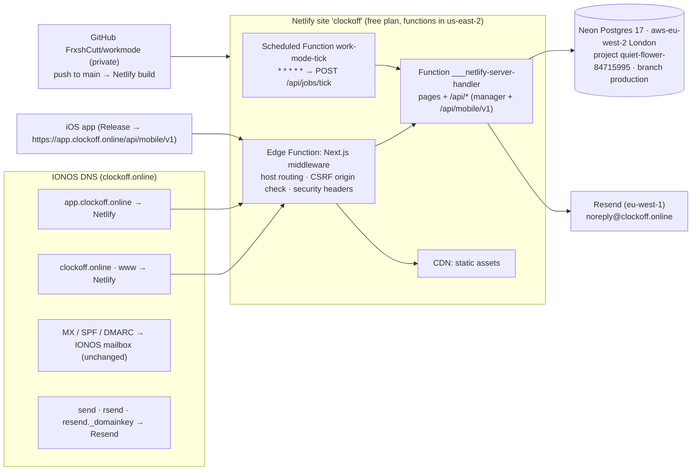

# Deployment

> **Status (2026-10-06):** live on Netlify at `https://clockoff.netlify.app` (production deploys from `main`).
> The custom domains `clockoff.online`, `www.clockoff.online` and `app.clockoff.online` are attached to the site
> and go live as soon as the IONOS DNS records in `docs/DNS_RECORDS.md` are in place.

## Hosting architecture



- **One Netlify site serves both sites.** With `HOST_ROUTING=on`, `src/middleware.ts` (an Edge Function) uses
  `src/server/http/hostRouting.ts`:
  - `www.clockoff.online` → 308 to `clockoff.online`.
  - `clockoff.online` serves the marketing pages, `/api/request-demo` and `/api/health`; dashboard and auth pages
    redirect to `app.clockoff.online`; any other `/api/*` returns 404, so session cookies only ever live on
    `app.clockoff.online`.
  - `app.clockoff.online` serves the dashboard, auth pages and every API; `/` redirects to `/overview`.
  - Any other host (`clockoff.netlify.app`, deploy previews, localhost) is served unchanged.
- **Background job:** `apps/web/netlify/functions/work-mode-tick.mts` is a Netlify Scheduled Function
  (`* * * * *`, 30-second limit) that POSTs `$APP_URL/api/jobs/tick` with `Authorization: Bearer $CRON_SECRET`.
  Scheduled functions only run on the published production deploy.
- **Access protection:** the Netlify account protects deploys with team login by default. The site is set to
  protect **non-production** contexts only (deploy previews, branch deploys); production is public.

### Known limitation: functions run in the US

The site is on Netlify's **free** plan, so its functions run in **US East (Ohio, `us-east-2`)** while the
database is in **London**. Every database query crosses the Atlantic (~70–80 ms per round trip), which makes
dashboard and API responses noticeably slower than they would be in one region, and employee data is processed
in the US under Netlify's Data Processing Agreement (stored in the UK by Neon).
**Remedy:** upgrade the Netlify team to Pro and set Site configuration → Functions → Region to **London
(`lhr`)**, then redeploy. No code change is needed.

### Other platform limits (accepted for the MVP)

| Area                     | Behaviour on Netlify                                                                                                                                    | Fix when it matters                                                                        |
| ------------------------ | ------------------------------------------------------------------------------------------------------------------------------------------------------- | ------------------------------------------------------------------------------------------ |
| Cold starts              | The first request after idle wakes both the function and Neon's auto-suspended compute (≈ 5–6 s observed).                                              | Neon paid plan (no suspend) and/or regular traffic; the minute job keeps the function warm |
| Request duration         | Synchronous functions stop at 60 s (not configurable). Nothing in the app comes close.                                                                  | —                                                                                          |
| Realtime dashboard (SSE) | Streams end at 60 s and reconnect; the event bus is per instance, so events raised elsewhere arrive through the dashboard's 30-second polling fallback. | Redis pub/sub adapter for `EventBus`                                                       |
| Rate limiting            | `memory` backend is per instance — best effort. Client IPs come from `x-nf-client-connection-ip`.                                                       | Redis rate limiter                                                                         |
| Silent pushes (APNs)     | Not configured. If enabled, `pushBridge`'s 5-second debounce timer may not fire in a frozen function.                                                   | Send via `runAfterResponse` or a queue before enabling APNs                                |
| Native modules           | `@node-rs/argon2` and the Prisma engine are platform-specific. **Always build on Netlify** (Git-triggered); never `netlify deploy --build` from a Mac.  | —                                                                                          |

## Build and continuous deployment

| Setting                            | Value                                                                                               |
| ---------------------------------- | --------------------------------------------------------------------------------------------------- |
| Netlify site                       | `clockoff` (id `b65c1658-1110-42ec-a926-637ae7d9415f`, team `frxshcutt`, free plan)                 |
| Repository                         | `FrxshCutt/workmode` (private), production branch `main`                                            |
| How builds start                   | GitHub push webhook → Netlify; Netlify clones with a read-only deploy key on the repository         |
| Base directory / package directory | repo root / `apps/web` (`apps/web/netlify.toml`)                                                    |
| Build command                      | `pnpm --filter @workmode/web run build:netlify` → `prisma generate` + `next build`                  |
| Publish directory                  | `apps/web/.next`                                                                                    |
| Functions directory                | `apps/web/netlify/functions`                                                                        |
| Runtime                            | `@netlify/plugin-nextjs` 5.16.2 (declared in `netlify.toml`, pinned in `apps/web` devDependencies)  |
| Node / pnpm                        | 22 / 11.10.0 (`[build.environment]`)                                                                |
| Prisma                             | `binaryTargets = ["native", "rhel-openssl-3.0.x"]` (Lambda engine bundled into the server function) |

## Environment variables (Netlify site, all contexts)

| Variable                                         | Value / origin                                                                                                                                                                |
| ------------------------------------------------ | ----------------------------------------------------------------------------------------------------------------------------------------------------------------------------- |
| `DATABASE_URL`                                   | Neon API — pooled connection (`ep-proud-bonus-za5wlmr7-pooler…eu-west-2.aws.neon.tech/clockoff`, `sslmode=require&pgbouncer=true&connect_timeout=15`). Copy in `.env.deploy`. |
| `APP_URL`, `NEXT_PUBLIC_APP_URL`                 | `https://app.clockoff.online`                                                                                                                                                 |
| `MARKETING_URL`                                  | `https://clockoff.online`                                                                                                                                                     |
| `HOST_ROUTING`                                   | `on`                                                                                                                                                                          |
| `CLIENT_IP_HEADER` / `TRUSTED_PROXY_HOPS`        | `x-nf-client-connection-ip` / `1`                                                                                                                                             |
| `SESSION_SECRET` (the "AUTH_SECRET" of this app) | 32 random bytes (base64), generated locally; copy in `.env.deploy`                                                                                                            |
| `MOBILE_JWT_SECRET` / `MOBILE_JWT_KEY_ID`        | 32 random bytes (base64) / `v1`                                                                                                                                               |
| `INTEGRATION_ENCRYPTION_KEY`                     | 32 random bytes (base64)                                                                                                                                                      |
| `CRON_SECRET`                                    | 32 random bytes (hex)                                                                                                                                                         |
| `SESSION_TTL_DAYS`                               | `14`                                                                                                                                                                          |
| `EMAIL_PROVIDER` / `EMAIL_FROM`                  | `resend` / `Work Mode <noreply@clockoff.online>`                                                                                                                              |
| `RESEND_API_KEY`                                 | supplied by the owner; copy in `.env.deploy`                                                                                                                                  |
| `REQUIRE_EMAIL_VERIFICATION`                     | not set → `true` in production (managers verify their email)                                                                                                                  |
| `JOBS_ENABLED`                                   | `false` (the scheduled function replaces the in-process runner)                                                                                                               |
| `DEV_TOOLS_ENABLED`                              | `false`                                                                                                                                                                       |
| `LOG_LEVEL` / `RATE_LIMIT_BACKEND`               | `info` / `memory`                                                                                                                                                             |

`DIRECT_URL` (unpooled Neon connection) is **not** set on Netlify; it is kept in `.env.deploy` for migrations.
Change variables with the Netlify API (`PUT /api/v1/accounts/{account_id}/env/{key}?site_id=…`) or the UI, then
redeploy (Edge Functions and functions read them at runtime, `NEXT_PUBLIC_*` at build time).

## Database (Neon)

|                  |                                                                                                                                   |
| ---------------- | --------------------------------------------------------------------------------------------------------------------------------- |
| Project          | `clockoff` (`quiet-flower-84715995`), organisation "ClockOff" (free plan)                                                         |
| Region / version | `aws-eu-west-2` (London) / Postgres 17                                                                                            |
| Branch           | `production` (`br-summer-band-zamyb83w`, default)                                                                                 |
| Database / role  | `clockoff` / `clockoff`                                                                                                           |
| Endpoints        | pooled `ep-proud-bonus-za5wlmr7-pooler.c-2.eu-west-2.aws.neon.tech`, direct `ep-proud-bonus-za5wlmr7.c-2.eu-west-2.aws.neon.tech` |

- **Migrations** run from a trusted machine against the direct endpoint:

  ```bash
  cd packages/db
  DATABASE_URL="$DIRECT_URL" pnpm exec prisma migrate deploy   # DIRECT_URL from .env.deploy
  ```

  Never use `migrate dev`, `migrate reset` or `db push` against production. `GET /api/health` returns
  `migrations: "up_to_date" | "pending" | "failed"` and a 503 unless everything is applied.

- **Seed:** never. The seed refuses `NODE_ENV=production` and any non-local database unless `ALLOW_SEED=true`.
- **First account:** register at `https://app.clockoff.online/register`; the first user creates the organisation
  and becomes OWNER. The production database was left empty.

### Backups and restore

Neon keeps point-in-time history of the branch. On the free plan the **restore window is 6 hours**
(`history_retention_seconds = 21600`); paid plans keep 7–30 days. There are no other automatic backups.

To restore:

1. Neon console → project `clockoff` → **Restore** → pick a time within the window, or via the API:
   `POST /api/v2/projects/quiet-flower-84715995/branches` with `{"branch": {"parent_id": "br-summer-band-zamyb83w", "parent_timestamp": "<ISO time>"}}`.
2. Inspect the restored branch through its own connection string.
3. Either restore the `production` branch in place from the console, or point `DATABASE_URL` on Netlify at the
   restored branch and redeploy.

Recommended until on a paid plan: a nightly `pg_dump "$DIRECT_URL" | gzip` to private storage.

## Email (Resend)

- `ResendEmailProvider` (`apps/web/src/server/email`) sends through Resend's HTTP API when `EMAIL_PROVIDER=resend`;
  development keeps `ConsoleEmailProvider`. Verification, password-reset, manager-invite and employee-invite emails
  all go through it.
- Sending domain `clockoff.online` (Resend id `538d0ad9-2bee-472e-9b12-36eff396662d`, region `eu-west-1`), from
  `noreply@clockoff.online`. Resend only delivers once its DNS records (`docs/DNS_RECORDS.md` §3) verify.

## Redeploy, roll back

- **Redeploy:** push to `main`. To rebuild without a commit:
  `curl -X POST -H "Authorization: Bearer $NETLIFY_AUTH_TOKEN" https://api.netlify.com/api/v1/sites/b65c1658-1110-42ec-a926-637ae7d9415f/builds`.
- **Roll back:** Netlify keeps every deploy. Publish an earlier one:
  `curl -X POST -H "Authorization: Bearer $NETLIFY_AUTH_TOKEN" https://api.netlify.com/api/v1/sites/b65c1658-1110-42ec-a926-637ae7d9415f/deploys/<DEPLOY_ID>/restore`
  (or Netlify UI → Deploys → pick one → "Publish deploy"). Migrations are forward-only: reverse a bad one with a
  new migration, or restore the database branch.
- **Schema changes:** run the (additive) migration first, then push the code that uses it.

## DNS record inventory

See `docs/DNS_RECORDS.md` (IONOS: apex A `75.2.60.5`, `www`/`app` CNAME `clockoff.netlify.app`, Resend DKIM/SPF
records on `resend._domainkey`, `send`, `rsend`; IONOS mail records unchanged; parking A/AAAA removed).

## iOS

Release builds call `https://app.clockoff.online/api/mobile/v1` (`apps/ios/Config/Release.xcconfig`,
`API_BASE_URL`, enforced by `Scripts/verify-release.sh`); Debug calls `http://localhost:3000/api/mobile/v1`.
