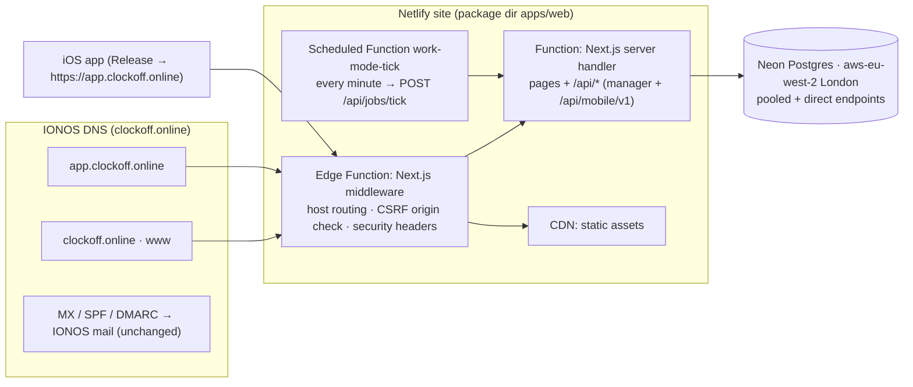

# Deployment

> **Status: not deployed yet.** The repository is prepared for Netlify (hosting), Neon (database) and IONOS
> (DNS for `clockoff.online`). The Netlify build has been run locally end to end. Provisioning is waiting for
> credentials in `.env.deploy` — see "What is still manual". Sections marked _(filled in at deploy time)_ are
> completed by the deployment run.

## Hosting architecture



- **One Netlify site serves both sites.** With `HOST_ROUTING=on`, `src/middleware.ts` (an Edge Function on
  Netlify) uses `src/server/http/hostRouting.ts`:
  - `www.clockoff.online` → 308 to `clockoff.online`.
  - `clockoff.online` serves the marketing pages, `/api/request-demo` and `/api/health`. Dashboard and auth
    pages redirect to `app.clockoff.online`; any other `/api/*` returns 404, so session cookies only ever
    live on `app.clockoff.online`.
  - `app.clockoff.online` serves the dashboard, auth pages and every API; `/` redirects to `/overview`.
  - Any other host (`*.netlify.app`, deploy previews, localhost) is served unchanged.
  - The middleware reads these variables at runtime (verified in the built Edge Function), so changing them
    only needs a redeploy of the site settings, not a code change.
- **Background job:** `apps/web/netlify/functions/work-mode-tick.mts` is a Netlify Scheduled Function
  (`* * * * *`, available on every Netlify plan, 30-second limit). It POSTs `https://app.clockoff.online/api/jobs/tick`
  with `Authorization: Bearer $CRON_SECRET`, so the tick runs in the same server bundle as every request.
  Scheduled functions only run on the published production deploy.
- **Regions:** the database is in London (`aws-eu-west-2`). Netlify Functions run in US East (Ohio) by
  default; choosing **London (`lhr`)** is a Pro/Enterprise setting (Site configuration → Functions → Region).
  On the free/Personal plan every database query crosses the Atlantic (~80 ms round trip), which makes
  dashboard pages noticeably slower and means personal data is processed in the US (covered by Netlify's DPA).

### Platform limits (known and accepted for the MVP)

| Area                     | Behaviour on Netlify                                                                                                                                                                             | Fix when it matters                                         |
| ------------------------ | ------------------------------------------------------------------------------------------------------------------------------------------------------------------------------------------------ | ----------------------------------------------------------- |
| Request duration         | Synchronous functions stop at 60 s (not configurable). Everything in the app is well under it.                                                                                                   | —                                                           |
| Realtime dashboard (SSE) | Streams end at the 60-second limit and reconnect; the event bus is per function instance, so events raised elsewhere arrive through the dashboard's 30-second polling fallback.                  | Redis pub/sub adapter for `EventBus`                        |
| Rate limiting            | `memory` backend is per instance — best effort. Client IPs come from `x-nf-client-connection-ip` (`CLIENT_IP_HEADER`).                                                                           | Redis rate limiter                                          |
| Silent pushes (APNs)     | `pushBridge` debounces with a 5-second timer that a frozen function may never fire; phones still re-sync on launch, foreground, background refresh and reconnect.                                | Send via `runAfterResponse` or a queue before enabling APNs |
| Native modules           | `@node-rs/argon2` and the Prisma engine are platform-specific. **Always build on Netlify** (Git-triggered builds); never `netlify deploy --build` from a Mac, which would upload macOS binaries. | —                                                           |

## Build

`apps/web/netlify.toml` (Netlify site: base directory = repo root, package directory = `apps/web`):

| Setting             | Value                                                                                                                                  |
| ------------------- | -------------------------------------------------------------------------------------------------------------------------------------- |
| Build command       | `pnpm --filter @workmode/web run build:netlify` → `prisma generate` + `next build`                                                     |
| Publish directory   | `apps/web/.next`                                                                                                                       |
| Functions directory | `apps/web/netlify/functions`                                                                                                           |
| Runtime             | Netlify Next.js runtime v5 (auto-detected)                                                                                             |
| Node                | 22 (`NODE_VERSION`)                                                                                                                    |
| pnpm                | 11.10.0 (`PNPM_VERSION`, matches `package.json#packageManager`)                                                                        |
| Prisma              | `binaryTargets = ["native", "rhel-openssl-3.0.x"]`; the Lambda engine is traced into the server function (verified in the local build) |

The build needs no secrets: environment variables are validated lazily at first use.

## Environment variables

Every variable is documented in `apps/web/.env.production.example` and `docs/ENVIRONMENT.md`.

| Variable                                                                           | Value / source                                                                                |
| ---------------------------------------------------------------------------------- | --------------------------------------------------------------------------------------------- |
| `DATABASE_URL`                                                                     | Neon API — pooled connection string (`-pooler` host, `sslmode=require&pgbouncer=true`)        |
| `DIRECT_URL`                                                                       | Neon API — direct connection; used only for migrations, kept in `.env.deploy`, not on Netlify |
| `APP_URL`, `NEXT_PUBLIC_APP_URL`                                                   | `https://app.clockoff.online`                                                                 |
| `MARKETING_URL`                                                                    | `https://clockoff.online`                                                                     |
| `HOST_ROUTING`                                                                     | `on`                                                                                          |
| `CLIENT_IP_HEADER`                                                                 | `x-nf-client-connection-ip`                                                                   |
| `SESSION_SECRET`, `MOBILE_JWT_SECRET`, `INTEGRATION_ENCRYPTION_KEY`, `CRON_SECRET` | Generated locally (32 random bytes), stored in `.env.deploy` and on Netlify; never printed    |
| `EMAIL_PROVIDER`, `EMAIL_FROM`                                                     | `console` / `Work Mode <noreply@clockoff.online>` until a real transport is configured        |
| `REQUIRE_EMAIL_VERIFICATION`                                                       | `false` until email works (see "What is still manual"), then unset                            |
| `APNS_*`                                                                           | Apple Developer → Keys (optional)                                                             |
| `JOBS_ENABLED`                                                                     | `false` (the scheduled function replaces the in-process runner)                               |
| `DEV_TOOLS_ENABLED`                                                                | `false`                                                                                       |

## Database

- Provider: Neon, region `aws-eu-west-2` (London) _(project id, branch and history retention filled in at
  deploy time)_.
- **Migrations:** always against the direct endpoint, from a trusted machine:

  ```bash
  cd packages/db
  DATABASE_URL="$DIRECT_URL" pnpm exec prisma migrate deploy
  ```

  Never use `migrate dev`, `migrate reset` or `db push` against production. `GET /api/health` returns
  `migrations: "up_to_date" | "pending" | "failed"` and a 503 unless everything is applied.

- **Seed:** never. The seed refuses `NODE_ENV=production` and any non-local host unless `ALLOW_SEED=true`.
- **First account:** register at `https://app.clockoff.online/register` (the first user creates the
  organisation and becomes OWNER), or set `INITIAL_OWNER_EMAIL`/`INITIAL_OWNER_PASSWORD` in `.env.deploy`.

### Backups and restore

Neon keeps point-in-time history of the branch (the "restore window"; its length depends on the Neon plan —
the deploy run records the configured value here). To restore:

1. Neon console → project → **Restore**, or the API (`POST /projects/{id}/branches` with `parent_timestamp`),
   to create a branch at a past instant.
2. Check the data on the new branch with a read-only connection.
3. Promote it to the default branch, or point `DATABASE_URL` at it on Netlify and redeploy.

For longer retention, schedule a nightly `pg_dump` of the direct endpoint to object storage.

## Redeploy, roll back

- **Redeploy:** push to `main` (Netlify builds from GitHub), or trigger a build:
  `npx netlify-cli api createSiteBuild --data '{"site_id":"<SITE_ID>"}'` with `NETLIFY_AUTH_TOKEN` set.
- **Roll back:** Netlify keeps every deploy. Publish an earlier one:
  `npx netlify-cli api restoreSiteDeploy --data '{"site_id":"<SITE_ID>","deploy_id":"<DEPLOY_ID>"}'`
  (or Deploys → pick a deploy → "Publish deploy"). Migrations are forward-only: reverse a bad one with a new
  migration, or restore the database branch.
- **Schema changes:** run the (additive) migration first, then deploy the code that uses it.

## DNS records (IONOS)

_(Exact values filled in at deploy time; also written to `docs/DNS_RECORDS.md`.)_

| Host                  | Type  | Value                               | Note                                                                                          |
| --------------------- | ----- | ----------------------------------- | --------------------------------------------------------------------------------------------- |
| `clockoff.online`     | A     | `75.2.60.5` (Netlify load balancer) | replaces the IONOS parking A record `217.160.0.186`                                           |
| `clockoff.online`     | AAAA  | —                                   | **delete** the IONOS parking AAAA (`2001:8d8:100f:f000::200`), or IPv6 visitors land on IONOS |
| `www`                 | CNAME | `<site>.netlify.app`                |                                                                                               |
| `app`                 | CNAME | `<site>.netlify.app`                |                                                                                               |
| MX, SPF TXT, `_dmarc` | —     | unchanged                           | IONOS mail keeps working                                                                      |

Netlify issues Let's Encrypt certificates for all three hostnames once they resolve to Netlify.

## iOS

The Release configuration points the app at `https://app.clockoff.online` (`apps/ios/Config/Release.xcconfig`,
`API_BASE_URL`); the mobile API lives under `/api/mobile/v1`. Debug keeps `http://localhost:3000`. No App
Transport Security exceptions are needed in Release (HTTPS only; `Scripts/verify-release.sh` checks it).

## What is still manual

1. Fill in `.env.deploy` (Netlify token, Neon key or connection strings, IONOS DNS key) and run the deployment.
2. Netlify plan: Pro if you want functions in London next to the database (recommended); otherwise accept
   US-East functions and the extra latency.
3. Email: production requires email verification by default, and password reset and manager invites are
   emailed. Until an email transport is configured, the deploy sets `REQUIRE_EMAIL_VERIFICATION=false` so the
   first manager can register; password reset and manager invites cannot be delivered.
4. Apple: developer team, Family Controls distribution entitlement for all four bundle ids, APNs key, App Store
   Connect record (`docs/IOS_SETUP.md`).
