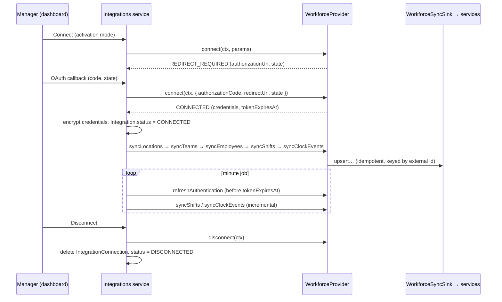

# Workforce integrations

ClockOff can take employees and shifts from the rota / time-and-attendance system a business already uses.
Six providers are listed in the product: **Planday, Deputy, 7shifts, When I Work, Rotaready and Homebase**.
All six are **Coming Soon** in the MVP: they appear on `/integrations`, can be "notified", and every API
call against them answers `501 COMING_SOON`. This document describes the abstraction they plug into and how
to ship the first real one (Planday).

Source: `packages/shared/src/providers/` (`workforceProvider.ts`, `syncSink.ts`, `registry.ts`,
`comingSoonProvider.ts`).

## The one rule

**Scheduling logic consumes `Shift` rows only — never provider objects.**

A provider's job ends when it has written ClockOff's own tables (`Employee`, `Location`, `Team`, `Shift`,
`ClockEvent`). The Work Mode state machine (`computeExpectedState`), break rules, the minute job, the
dashboard and the iOS sync all read those rows exactly as they read manual or CSV-imported shifts
(`Shift.source = INTEGRATION`). Consequences:

- A provider can be added, replaced, disconnected or broken without touching scheduling code.
- Shifts from an integration are validated, versioned and pushed to devices by the same shifts service as
  manual shifts (15-minute minimum, overlap detection, `SHIFT_CREATED` / `SHIFT_UPDATED` activity, schedule
  version bump and silent push).
- If a provider is down, ClockOff keeps enforcing the last synced schedule.

## The interface (§6.6)

```ts
type ProviderId = IntegrationProvider; // PLANDAY | DEPUTY | SEVENSHIFTS | WHEN_I_WORK | ROTAREADY | HOMEBASE

interface WorkforceProvider {
  readonly id: ProviderId;
  readonly displayName: string;
  readonly status: "AVAILABLE" | "COMING_SOON";
  connect(ctx: ProviderContext, params: ConnectParams): Promise<ConnectResult>;
  disconnect(ctx: ProviderContext): Promise<void>;
  refreshAuthentication(ctx: ProviderContext): Promise<void>;
  syncEmployees(ctx: ProviderContext): Promise<SyncReport>;
  syncShifts(ctx: ProviderContext, range: SyncRange): Promise<SyncReport>;
  syncLocations(ctx: ProviderContext): Promise<SyncReport>;
  syncTeams(ctx: ProviderContext): Promise<SyncReport>;
  syncClockEvents(ctx: ProviderContext, since: Date): Promise<SyncReport>;
  getConnectionStatus(ctx: ProviderContext): Promise<ConnectionStatus>;
}
```

Supporting types (all in `workforceProvider.ts` / `syncSink.ts`):

| Type                | Purpose                                                                                                                                                                                                            |
| ------------------- | ------------------------------------------------------------------------------------------------------------------------------------------------------------------------------------------------------------------ |
| `ProviderContext`   | `{ organisationId, integrationId, settings, credentials?, now, sink? }`. `credentials` arrive **decrypted**; `settings` is `Integration.settings`; `now` is an injected UTC clock; `sink` is where sync writes go. |
| `ConnectParams`     | `{ activationMode, credentials?, authorizationCode?, redirectUri?, state?, settings? }`.                                                                                                                           |
| `ConnectResult`     | `{ kind: "CONNECTED", credentials, tokenExpiresAt, externalAccountId?, externalAccountName?, settings? }` or `{ kind: "REDIRECT_REQUIRED", authorizationUrl, state }` for OAuth authorization-code flows.          |
| `SyncRange`         | Half-open UTC window `[from, to)` for `syncShifts`.                                                                                                                                                                |
| `SyncReport`        | `{ provider, startedAt, finishedAt, created, updated, skipped, errors: [{ code, message, externalId? }] }`. Build it with `createSyncReportBuilder()`.                                                             |
| `ConnectionStatus`  | `{ status: IntegrationStatus, connected, lastSyncAt, tokenExpiresAt, lastError, externalAccountName? }`.                                                                                                           |
| `WorkforceSyncSink` | `upsertLocation`, `upsertTeam`, `upsertEmployee`, `upsertShift`, `recordClockEvent` (each returns `CREATED` / `UPDATED` / `UNCHANGED` / `SKIPPED`) and `saveCredentials`.                                          |

Sync error codes: `PROVIDER_ERROR`, `RATE_LIMITED`, `AUTH_EXPIRED`, `UNKNOWN_EMPLOYEE`, `UNKNOWN_LOCATION`,
`INVALID_TIME`, `MAPPING_FAILED`, `CONFLICT`. A failing record is reported in `SyncReport.errors` and
skipped; it never aborts the whole sync. A failure of the provider itself (auth refused, outage, rate limit)
rejects the method with a `ProviderError(provider, code, message)`; `retryable` is true only for
`PROVIDER_ERROR` and `RATE_LIMITED`.

### Registry

```ts
listProviders(): ProviderMetadata[]           // enum order; status reflects registered implementations
getProvider(id: ProviderId): WorkforceProvider // registered implementation, else a ComingSoonProvider
getProviderMetadata(id): ProviderMetadata      // id, displayName, website, description, activationModes, status
providerAvailability(id): "AVAILABLE" | "COMING_SOON"
isProviderId(value: unknown): value is ProviderId
registerProvider(provider) / unregisterProvider(id)
```

`PROVIDERS` holds the static metadata (display name `7shifts` for `SEVENSHIFTS`). Unknown ids raise
`AppError("NOT_FOUND")`. `ComingSoonProvider(id, displayName)` implements every method by rejecting with
`AppError("COMING_SOON", "<Name> integration is coming soon", { details: { provider } })`, which the API
wrapper turns into HTTP 501 `{ error: { code: "COMING_SOON", … } }`.

## Data model

| Table                   | Role                                                                                                                                                                  |
| ----------------------- | --------------------------------------------------------------------------------------------------------------------------------------------------------------------- |
| `Integration`           | One row per organisation and provider: `status` (`NOT_CONNECTED` / `CONNECTED` / `ERROR` / `DISCONNECTED`), `settings` JSON, `activationMode`, `notifyRequested`.     |
| `IntegrationConnection` | Secrets for a connected integration: `encryptedCredentials`, `tokenExpiresAt`, `lastSyncAt`, `lastError`.                                                             |
| `Employee`              | `externalEmployeeId` (unique per organisation) links a person to the provider.                                                                                        |
| `Shift`                 | `source = INTEGRATION`, `externalShiftId` (unique per organisation), `timezone`, `status`, `version`.                                                                 |
| `ClockEvent`            | `CLOCK_IN` / `CLOCK_OUT` / `BREAK_START` / `BREAK_END` with `occurredAt`, `source` (the provider id) and `externalId`; unique per (organisation, source, externalId). |

`Location` and `Team` have no external-id columns yet. Until the first provider ships, the
external-id → ClockOff id mapping lives in `Integration.settings` (`{ locationMap: { [externalId]: locationId }, teamMap: { … } }`);
adding `externalId` columns with a per-organisation unique index is the cleaner follow-up.

## Lifecycle



1. **Connect.** The manager picks an activation mode and starts the connection. Authorization-code providers
   return `REDIRECT_REQUIRED`; the service stores `state` (CSRF) and redirects. On callback it calls
   `connect` again with the code. The `CONNECTED` result's `credentials` are encrypted and stored in
   `IntegrationConnection`; `Integration.status` becomes `CONNECTED`.
2. **Initial sync.** Order matters because later records reference earlier ones: locations, teams, employees,
   then shifts (default window: now − 1 day to now + 8 weeks, the same horizon as recurring shifts), then
   clock events (`CLOCK_EVENT` mode only).
3. **Ongoing sync.** The minute job (`apps/web/src/jobs/main.ts`) refreshes tokens shortly before
   `tokenExpiresAt` (`refreshAuthentication` stores new tokens via `sink.saveCredentials`), runs incremental
   shift syncs (for example every 15 minutes) and, in `CLOCK_EVENT` mode, clock-event syncs every minute.
   Each run updates `IntegrationConnection.lastSyncAt`; a run with record errors still succeeds and its
   `SyncReport` is logged and summarised in the dashboard.
4. **Errors.** If a provider call rejects (expired consent, revoked app, outage), the service sets
   `Integration.status = ERROR`, stores `lastError`, records an `INTEGRATION_ERROR` activity event and keeps
   retrying with backoff. Shifts already synced stay in force.
5. **Disconnect.** `disconnect` revokes tokens upstream where the provider supports it; the service deletes the
   `IntegrationConnection` row (and with it the credentials) and sets `status = DISCONNECTED`. Synced
   employees and shifts remain as ordinary ClockOff data that managers can edit or cancel.

### Sync semantics

- **Idempotent upserts** keyed by external id. Re-running a sync produces `UNCHANGED`, not duplicates.
- **External ids are namespaced by provider.** `Employee.externalEmployeeId` and `Shift.externalShiftId` are
  unique per organisation, not per provider, and an organisation may connect more than one provider. Providers
  pass the provider's raw ids; the sink stores them as `<PROVIDER>:<id>` (for example `PLANDAY:4711`) so two
  providers can never collide. `ClockEvent` is already keyed by (`source`, `externalId`).
- **Never hard-delete.** A shift deleted or cancelled upstream becomes `Shift.status = CANCELLED`
  (`SHIFT_CANCELLED` activity). Employees missing or deactivated upstream are reported, not deactivated
  automatically: deactivation affects a person's phone, so a manager confirms it.
- **Matching employees.** By `externalEmployeeId` first; otherwise by email (case-insensitive) within the
  organisation, which links someone added manually before the integration was connected; otherwise create.
  `inviteStatus`, devices and ClockOff settings are never changed by a sync.
- **Open shifts** (no assigned employee) are skipped. Shifts shorter than 15 minutes, ending before they
  start or overlapping another shift for the same employee are reported (`INVALID_TIME` / `CONFLICT`) and
  skipped.
- **Times.** Providers that return local wall-clock times are converted to UTC with the site's IANA zone
  using the shared time helpers (`packages/shared/src/time`), and the zone is kept on `Shift.timezone`.

## Activation modes

`Integration.activationMode` decides what turns Work Mode on for that organisation's synced staff:

| Mode          | ClockOff follows                        | How it reaches the state machine                                                                                                                                                                                                                                                               |
| ------------- | --------------------------------------- | ---------------------------------------------------------------------------------------------------------------------------------------------------------------------------------------------------------------------------------------------------------------------------------------------- |
| `SCHEDULED`   | The rota: shifts as published upstream. | `syncShifts` upserts `Shift` rows; nothing else changes. Same behaviour as manual or CSV shifts.                                                                                                                                                                                               |
| `CLOCK_EVENT` | Actual clock-in and clock-out.          | `syncClockEvents` records `ClockEvent` rows. A reconciler pairs `CLOCK_IN` / `CLOCK_OUT` per employee and upserts one `Shift` per pair (`externalShiftId = clock:<provider>:<clock-in id>`; ends at clock-out, or while still clocked in at the matched rota shift's end, capped at 12 hours). |

In `CLOCK_EVENT` mode the provider's rota is not imported as `Shift` rows (otherwise Work Mode would start at
the scheduled time even if nobody clocked in); the rota stays in the provider. `BREAK_START` / `BREAK_END`
punches are stored for reference only: breaks still follow ClockOff's Break Rules (started by the employee in
the app, or scheduled on the shift).

Clock-event mode depends on how fast the event reaches the phone: provider → sync (≤ 1 minute polling, or a
webhook later) → silent push → device re-plans its DeviceActivity schedule. Apple's 15-minute minimum
DeviceActivity interval applies to the derived shift as to any other. The dashboard explains this trade-off
next to the mode picker.

## Adding Planday (first real provider)

Planday's Open API is OAuth 2.0 based. The outline below is the intended design; verify endpoint names,
scopes and token lifetimes against Planday's current developer documentation before implementing.

1. **Register an app** in Planday's developer portal to get a client id (and secret where required) and set
   the redirect URI to `${APP_URL}/api/integrations/planday/callback`. Add `PLANDAY_CLIENT_ID` and
   `PLANDAY_CLIENT_SECRET` to `apps/web/src/lib/env.ts` and `docs/ENVIRONMENT.md` (they do not exist yet).
2. **Auth.**
   - _Authorization code (preferred):_ `connect` without a code returns `REDIRECT_REQUIRED` with Planday's
     authorize URL (client id, redirect URI, requested scopes for HR, scheduling and punch clock, random
     `state`). On callback, `connect` exchanges the code at Planday's token endpoint for an access token
     (short-lived) and a refresh token, and returns them as `credentials` with `tokenExpiresAt`.
   - _Client-credentials style (portal-issued token):_ where a portal administrator generates a token for the
     app instead, `connect` receives it in `params.credentials`, validates it with one API call and returns
     `CONNECTED` directly.
   - `refreshAuthentication` uses the refresh token to obtain a new access token and calls
     `sink.saveCredentials`. A refusal means consent was revoked: reject with
     `ProviderError("PLANDAY", "AUTH_EXPIRED", …)` so the service marks the integration `ERROR` and asks the
     manager to reconnect.
   - Every API request sends the bearer access token and the client-id header Planday requires.
3. **Mapping** (pure functions in `packages/shared/src/providers/planday/`, unit-tested with recorded
   payloads; the HTTP client lives in `apps/web/src/server/integrations/`):

   | Planday            | ClockOff                                                                                                                                                                                                                                           |
   | ------------------ | -------------------------------------------------------------------------------------------------------------------------------------------------------------------------------------------------------------------------------------------------- |
   | Department         | `Location` (via `settings.locationMap`; the portal or department zone becomes `Location.timezone`)                                                                                                                                                 |
   | Employee group     | `Team`                                                                                                                                                                                                                                             |
   | Employee           | `Employee` keyed by `externalEmployeeId = PLANDAY:<Planday employee id>`; first/last name, email, phone, job title; department → primary location; groups → teams                                                                                  |
   | Shift              | `Shift` keyed by `externalShiftId = PLANDAY:<Planday shift id>`; assigned employee, department → location, start/end converted to UTC with the department's zone; only shifts in a published/approved state are `SCHEDULED`; deleted → `CANCELLED` |
   | Punch-clock record | `ClockEvent` (`source = "PLANDAY"`): punch-in → `CLOCK_IN`, punch-out → `CLOCK_OUT`, with `externalId = <punch id>:in` / `<punch id>:out`                                                                                                          |

4. **Implement** `PlandayProvider implements WorkforceProvider` with `status: "AVAILABLE"`, paging and
   rate-limit handling (back off on HTTP 429; if retries are exhausted reject with a `RATE_LIMITED`
   `ProviderError`), and register it once at server
   start-up: `registerProvider(new PlandayProvider(config))`. `listProviders()` then reports Planday as
   `AVAILABLE` and the dashboard shows a Connect button instead of Notify me. Set
   `PROVIDERS.PLANDAY.status` to `"AVAILABLE"` when it ships so static listings agree.
5. **Test** mapping with recorded fixtures (time zones and DST included), the provider against a local
   `MockPlandayServer` (test-only), and the end-to-end sync against the integration test database: a second
   run must report zero created rows.

## "Coming Soon" UX

- `/integrations` renders one card per `listProviders()` entry: name, description, website, supported
  activation modes and a "Coming soon" badge.
- **Notify me** sets `Integration.notifyRequested = true` for that organisation and provider (creating the
  `Integration` row with `status = NOT_CONNECTED` if needed), so demand can be measured and managers told
  when it ships.
- Any connect, sync or disconnect call for a Coming Soon provider is answered by `ComingSoonProvider`:
  HTTP 501 `{ error: { code: "COMING_SOON", message: "<Name> integration is coming soon" } }`. The dashboard
  maps the code to friendly copy; nothing pretends to connect.
- The activation-mode explainer on the page describes `SCHEDULED` versus `CLOCK_EVENT` as above, so managers
  can plan before an integration is available. Until then, shifts come from the schedule editor or CSV import.

## Credential security

- Credentials are serialised to JSON and encrypted with **AES-256-GCM** using `INTEGRATION_ENCRYPTION_KEY`
  (32 bytes, base64) through `encrypt` / `decrypt` in `apps/web/src/lib/crypto.ts`. Stored layout:
  `iv (12 bytes) | auth tag (16 bytes) | ciphertext` in `IntegrationConnection.encryptedCredentials`. A fresh
  random IV is used for every encryption; the tag authenticates the ciphertext, so tampering fails loudly.
- Decryption happens only in the integrations service, immediately before building the `ProviderContext`.
  Credentials are never logged, never sent to the browser and never included in API responses or audit-log
  `before` / `after` snapshots (record that a connection changed, not its secrets).
- The same key protects device push tokens. Rotating it currently means re-encrypting every
  `IntegrationConnection` and push token with the new key in one maintenance step; a key-id prefix for
  zero-downtime rotation is a planned improvement.
- Connecting, disconnecting and changing the activation mode require the `integrations:write` permission
  (OWNER and ADMIN) and are recorded in the audit log.
