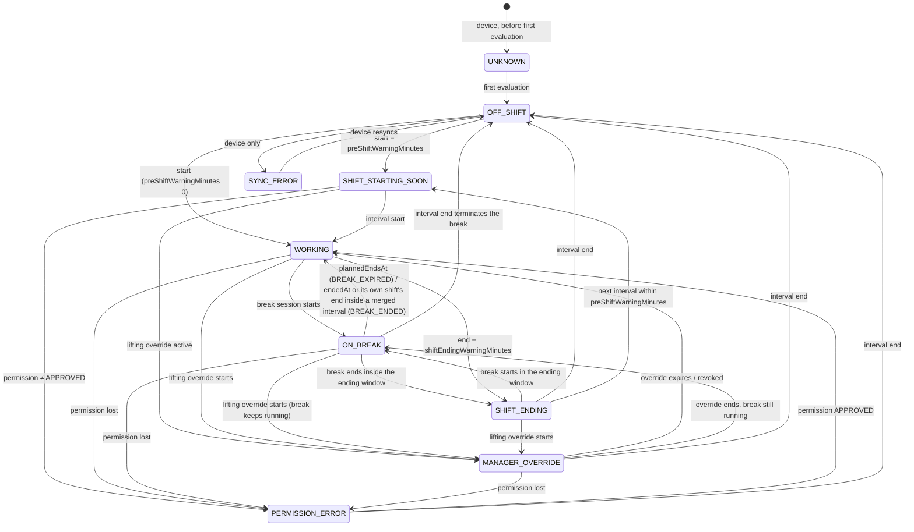

# Work Mode state machine (§6.2)

The Work Mode state machine decides, for one employee at one instant, what state they are in and which
restriction their phone should be enforcing. It is a **pure function** over plain rows (shifts, break
sessions, manager overrides, Screen Time permission). There are no clocks, no I/O and no framework
dependencies. The same contract is implemented twice:

| Runtime | Implementation | Runs |
| --- | --- | --- |
| Server / dashboard | `packages/shared/src/workMode/` (TypeScript) | the background job (every minute), API handlers, dashboard previews |
| iOS | `WorkModeCore` engine (Swift port) | on device, from the cached schedule, inside the app and the DeviceActivity monitor extension |

Both run the **same fixture file**, [`docs/fixtures/workmode-cases.json`](fixtures/workmode-cases.json), so
any difference between them is a bug.

```ts
import {
  computeExpectedState, // (input) => ExpectedState
  diffStates,           // (prev, next) => Transition[]
  replayTransitions,    // (input, since, previous?) => { states, transitions }
  mergeShiftIntervals,  // (shifts) => WorkingInterval[]
  toExpectedStateJson,  // ExpectedState → wire/fixture JSON (ISO strings)
} from "@workmode/shared/workMode/workModeMachine"; // also re-exported from "@workmode/shared"
```

---

## 1. States

`WorkModeState` comes from `@workmode/shared/enums` and mirrors the Prisma enum.

| State | Produced by the machine? | Meaning |
| --- | --- | --- |
| `OFF_SHIFT` | yes | No working interval in progress, and none starts within `preShiftWarningMinutes`. |
| `SHIFT_STARTING_SOON` | yes | `now ∈ [start − preShiftWarningMinutes, start)` of the next working interval. Nothing is enforced yet. |
| `WORKING` | yes | `now ∈ [start, end)` of a working interval, with no break running. Full WORK restriction. |
| `ON_BREAK` | yes | A break session of the current interval is running. Restriction per the break's behaviour snapshot. |
| `SHIFT_ENDING` | yes | `now ∈ [end − shiftEndingWarningMinutes, end)` of the **merged** working interval, with no break running. WORK restriction still on. |
| `MANAGER_OVERRIDE` | yes | A lifting override (`EXEMPT_TEMPORARILY`, `END_WORK_MODE_EARLY`, `EMERGENCY_POLICY_OVERRIDE`) is active while a shift is active or imminent. Restriction `NONE`. |
| `PERMISSION_ERROR` | yes | Screen Time permission is not `APPROVED` while a shift is active or imminent. |
| `SYNC_ERROR` | **no** | Device side only: the engine could not get a schedule or policy it trusts. |
| `UNKNOWN` | **no** | Device side only: no evaluation has happened yet (fresh install, before the first sync). |

All intervals are **start-inclusive and end-exclusive**. At exactly 09:00 a 09:00–15:00 shift is `WORKING`, and
at exactly 15:00 it is over.

## 2. Inputs

```ts
computeExpectedState({
  now,              // Date | ISO-8601 string WITH an offset ("Z" or "±hh:mm"); naive strings are rejected
  shifts,           // WorkModeShiftLike[]        { id, startsAt, endsAt, status, version?, deletedAt? }
  breakSessions?,   // WorkModeBreakSessionLike[] { id, shiftId, startedAt, plannedEndsAt, endedAt?, status,
                    //                              restrictionBehaviour, relaxedCategories (JSON) }
  overrides?,       // WorkModeOverrideLike[]     { id, type, startsAt, expiresAt, revokedAt?, employeeId?, payload? }
  permissionState,  // PermissionState
  timezone?,        // IANA zone, informational only (see below)
  employeeId?,      // when set, overrides scoped to another employee are ignored
  options?,         // { preShiftWarningMinutes = 15, shiftEndingWarningMinutes = 5 }
})
```

- **Prisma rows satisfy these shapes directly.** Each type uses a `WorkMode…Like` name because the
  `@workmode/shared` barrel already exports a narrower `BreakSessionLike` from `breaks/`.
- **All instants are UTC.** `Date` objects and offset ISO strings are accepted and normalised. A string
  without an offset throws `TypeError`, because it would otherwise be read in the host's zone. Negative or
  non-finite options throw `RangeError`. An unknown enum value (shift status, break status or behaviour,
  override type, permission) throws `TypeError`. All of these are programmer or data errors. Every row the
  machine uses is validated up front, so a bad row fails the same way whatever `now` is. Rows ignored
  outright (another employee's override, an `ENDED` break without `endedAt`) are skipped before validation.
- **`timezone` is informational.** The machine never converts with it. It is kept in the signature for
  parity with the Swift port and echoed on the output, so presentation code can format local times. DST is
  safe because shifts are stored as UTC instants: a 22:00→06:00 shift on the spring-forward night simply
  lasts 7 real hours (see the `dst-*` fixtures).
- **Which shifts count.** Only `status === "SCHEDULED"` shifts without `deletedAt`. `CANCELLED` and
  `COMPLETED` shifts, soft-deleted rows, zero-length or inverted shifts and duplicate ids are ignored.
- **Breaks.** A session runs during `[startedAt, min(plannedEndsAt, endedAt, end of its own shift))`, the
  same effective end `breaks/` uses for the allowance and for the `SHIFT_ENDED` sweep, so the two never
  disagree. An `ACTIVE` row whose `plannedEndsAt` has passed is treated as **expired**, and an `endedAt`
  later than `plannedEndsAt` does not extend it. Any row with `endedAt` ends there, whatever its status. An
  `ENDED` row counts only up to its `endedAt`, so replaying the past still sees it, and an `ENDED` row with
  no `endedAt` is ignored. A break whose `shiftId` is not part of the current working interval (unknown,
  cancelled, deleted or another day's shift) is ignored. If two sessions overlap (which is bad data), the
  most recently started one wins.
- **Overrides.** An override is active during `[startsAt, min(expiresAt, revokedAt))`. A
  `TEMPORARY_EXCEPTION` takes its behaviour from `payload.restrictionBehaviour` and
  `payload.relaxedCategories`, and defaults to `RELAX_ALL`. **The machine does not resolve a stored
  `{ breakPolicyId }`.** Callers must merge that policy's `resolveBreakBehaviour(...)` into the payload first.
  Org-wide overrides (`employeeId` null) always apply; with `input.employeeId` set, overrides scoped to
  another employee are ignored, and without it every supplied override applies.

## 3. Precedence (highest first)

1. **Off shift short-circuit.** If no working interval is in progress and none is imminent (it starts within
   `preShiftWarningMinutes`), the result is `OFF_SHIFT` / `NONE`. Overrides and permission problems are not
   surfaced off shift.
2. **`PERMISSION_ERROR`.** Applies when permission is not `APPROVED` and a shift is active or imminent. It
   dominates everything below. The *intended* `effectiveRestriction` / `restrictionsShouldBeActive` are still
   reported, so the dashboard can show what the phone should be enforcing.
3. **`MANAGER_OVERRIDE`.** Applies when an `EMERGENCY_POLICY_OVERRIDE`, `END_WORK_MODE_EARLY` or
   `EXEMPT_TEMPORARILY` override is active (ranked in that order when several are active), whether the shift
   is active or imminent. The restriction is `NONE`. A running break keeps being reported in `activeBreak`,
   because the session still runs and counts towards the allowance.
4. **`ON_BREAK`.** A break session of the current interval is running. Its stored snapshot sets the
   restriction (§4).
5. **`TEMPORARY_EXCEPTION`.** Applies when one is active during a shift in progress with no break running
   (a running break's own snapshot wins; the exception resumes when the break ends). The state is unchanged
   (`WORKING` or `SHIFT_ENDING`), but the restriction follows the exception's behaviour. An exception that
   relaxes nothing (`KEEP_RESTRICTIONS`, or `RELAX_CATEGORIES` with no known category) is not reported and
   does not mask another one that does relax. Among relaxing exceptions, the earliest-starting one applies
   (ties: id). An exception has no effect while the shift is only imminent.
6. **`SHIFT_ENDING`.** `now ∈ [intervalEnd − shiftEndingWarningMinutes, intervalEnd)`.
7. **`WORKING`.** `now ∈ [intervalStart, intervalEnd)`.
8. **`SHIFT_STARTING_SOON`.** `now ∈ [intervalStart − preShiftWarningMinutes, intervalStart)`.

### Working intervals: overlapping and back-to-back shifts

`mergeShiftIntervals(shifts)` takes the union of the effective shifts. A shift that starts at or before the
running end of the current interval extends it. As a result:

- Restrictions **never flap** between back-to-back shifts (09–13 + 13–17 is one interval, 09–17).
- `SHIFT_ENDING` applies only to the **end of the merged interval** (never at 12:55 in that example).
- A break belongs to its own shift, so a break of the first shift still ends at 13:00 ("shift end always
  terminates a break"). Only the relaxation ends: the employee goes `ON_BREAK → WORKING` with no
  `WORK_MODE_ENDED`/`WORK_MODE_STARTED` (fixtures `b2b-break-*`, `overlap-break-ends-at-own-shift-end`).
- `activeShift` is the earliest-starting shift that covers `now`. When it changes inside one interval
  (13:00 above), that is **not** a transition.
- Any positive gap (even 1 ms) keeps intervals separate. A cancelled shift never bridges two scheduled ones.

## 4. Output and restrictions

```ts
interface ExpectedState {
  state: WorkModeState;
  effectiveRestriction: "WORK" | "BREAK_RELAXED" | "NONE";
  restrictionsShouldBeActive: boolean;   // is at least part of the shield set enforced?
  computedAt: Date;                      // = now
  timezone: string | null;
  permissionState: PermissionState;
  activeShift: ShiftRef | null;          // in progress only (null while merely imminent)
  upcomingShift: ShiftRef | null;        // first shift of the next interval starting after now
  activeBreak: BreakRef | null;          // incl. effective `endsAt`
  activeOverride: OverrideRef | null;    // the override that changed the output
  workingInterval: WorkingInterval | null; // current, or the imminent one
  relaxation: { source: "BREAK" | "OVERRIDE"; restrictionBehaviour; relaxedCategories; liftedCategories } | null;
  nextTransitionAt: Date | null;
}
```

`toExpectedStateJson()` converts this to `ExpectedStateJson`, with every instant as an ISO string. That is the
wire and fixture form, and `JSON.stringify(state)` produces the same thing.

| Situation | `effectiveRestriction` | `restrictionsShouldBeActive` | `liftedCategories` |
| --- | --- | --- | --- |
| `OFF_SHIFT`, `SHIFT_STARTING_SOON`, `MANAGER_OVERRIDE` | `NONE` | `false` | – |
| `WORKING`, `SHIFT_ENDING` | `WORK` | `true` | – |
| Break or exception, `KEEP_RESTRICTIONS` | `WORK` | `true` | – |
| Break or exception, `RELAX_CATEGORIES` with an empty list | `WORK` | `true` | – |
| Break or exception, `RELAX_CATEGORIES` with ≥ 1 category | `BREAK_RELAXED` | `true` (unless every category is listed) | the listed categories, canonical order |
| Break or exception, `RELAX_ALL` | `BREAK_RELAXED` | `false` | every category |
| `PERMISSION_ERROR` | the intended value from the rows above | intended | intended |

> **Note:** `effectiveRestriction` names the *profile*, so a relaxed break is never confused with "off shift"
> or a manager override (`NONE`). `restrictionsShouldBeActive` and `liftedCategories` say what is actually
> enforced. `breakRestrictionForSession()` in `breaks/` uses exactly the same mapping, and its parity test
> runs both against each other.

### `nextTransitionAt`

`nextTransitionAt` is the earliest future instant at which the output **really changes**: the state, the
restriction, the relaxation, the active break or override, or entering an interval (imminent → in progress).
It is never a no-op instant, such as the end of the first of two back-to-back shifts, or 14:55 while
`PERMISSION_ERROR` masks `SHIFT_ENDING`. It is `null` when nothing in the supplied rows will ever change the
output again (for example, no future shift).

It is computed by evaluating every candidate boundary (interval start − warning, start, end − warning, end;
break start, planned end, end; override start, expiry, revocation) in order, and stopping at the first one
whose evaluation differs. The fixture suite checks that the output at `nextTransitionAt − 1 ms` equals the
output at `now`, and that the output at `nextTransitionAt` differs.

> **Important:** `null` means "no change in the rows you passed". Load shifts far enough ahead (at least 48
> hours for the server job) or `nextTransitionAt` will stop at your window.

## 5. State diagram



`TEMPORARY_EXCEPTION` does not appear in the diagram because it never changes the state. It only changes
`effectiveRestriction` while the employee is `WORKING` or `SHIFT_ENDING`.

## 6. Transitions → ActivityEvents

`diffStates(prev, next)` takes `prev` as a full `ExpectedState` or a bare `WorkModeState`. It returns one
`Transition { from, to, at, eventType?, shiftId?, breakSessionId?, overrideId? }` per ActivityEvent, in
causal order:

| # | Condition | `eventType` | ids |
| --- | --- | --- | --- |
| 1 | entered `PERMISSION_ERROR` | `PERMISSION_NEEDS_ATTENTION` | shiftId (active or upcoming) |
| 2 | previous break no longer running, and it ran to its `plannedEndsAt` (a tie with its shift's end counts) | `BREAK_EXPIRED` | breakSessionId, shiftId |
| 2 | previous break no longer running otherwise (early end, cut short by its shift's end, shift cancelled) | `BREAK_ENDED` | breakSessionId, shiftId |
| 3 | left `WORKING`/`ON_BREAK`/`SHIFT_ENDING`, or moved to another interval | `WORK_MODE_ENDED` | shiftId, overrideId if a lifting override caused it |
| 4 | previous override gone and its `expiresAt` passed (a revoke emits nothing) | `OVERRIDE_EXPIRED` | overrideId, shiftId |
| 5 | entered `WORKING`/`ON_BREAK`/`SHIFT_ENDING`, or moved to another interval | `WORK_MODE_STARTED` | shiftId |
| 6 | a different break session is now running | `BREAK_STARTED` | breakSessionId, shiftId |
| – | something else changed (e.g. `OFF_SHIFT → SHIFT_STARTING_SOON`, `WORKING → SHIFT_ENDING`, an exception starting) | *(none)*: one Transition so the caller knows to persist | – |
| – | nothing changed | `[]` | – |

- Losing permission mid-shift emits `PERMISSION_NEEDS_ATTENTION` and then `WORK_MODE_ENDED`. Regaining it
  emits `WORK_MODE_STARTED`.
- Back-to-back shifts produce `[]` at the handover.
- A break running under `MANAGER_OVERRIDE` or `PERMISSION_ERROR` does not emit `BREAK_ENDED` when the
  override or error begins. Its expiry inside the override does emit `BREAK_EXPIRED`.
- With a bare `prev` state, only state-level events are derived: `BREAK_ENDED` rather than `BREAK_EXPIRED`,
  no `OVERRIDE_EXPIRED`, and no interval-change detection. Pass the previous `ExpectedState` whenever you have it.
- `at` is `next.computedAt`, the instant of observation.
- **Which shift an event names.** Break events name the break's own shift. `PERMISSION_NEEDS_ATTENTION`,
  `WORK_MODE_STARTED` and `BREAK_STARTED` name `next`'s shift. `WORK_MODE_ENDED` and `OVERRIDE_EXPIRED` name
  the shift that was in progress immediately before the change, looked up in `prev`'s working interval. This
  matters inside merged intervals, where the active shift changes without a transition: a Work Mode that
  ends at 17:00 after back-to-back 09–13 and 13–17 shifts names the 13–17 shift even if `prev` was observed
  at 10:00.
- **`OVERRIDE_EXPIRED` is only derived for an override that was shaping the output when it expired** (the
  previous `activeOverride`). An override that expires while it has no effect is not seen: off shift, while
  masked by a higher-ranked override, or a `TEMPORARY_EXCEPTION` hidden by a running break. The server job
  sweeps `ManagerOverride` rows with `expiresAt ≤ now` and no `expiredEventEmittedAt` for those, and uses the
  same column to deduplicate.

### Exact instants: `replayTransitions(input, since)`

A single diff across a long gap collapses intermediate changes. For example, a whole break between two ticks
yields `[]`. `replayTransitions` walks `nextTransitionAt` from `since` up to `input.now` over the same rows
and returns every state plus every Transition, with `at` equal to the exact instant of the change. **Use its
`at` as `ActivityEvent.occurredAt`.** A change exactly at `since` is not included (the previous run, whose
`now` was `since`, already emitted it); a change exactly at `now` is. It reflects the rows as they are now.
For example, a break that was ended early is seen through its `endedAt` (`BREAK_STARTED` at 10:15,
`BREAK_ENDED` at 10:20).

The optional third argument, `previous`, is what was persisted at `since`: a bare `WorkModeState` or, better,
the full `ExpectedState` from the last run. Rows can change in ways that rewrite the past (permission lost,
since `permissionState` applies to the whole replay; a shift cancelled, deleted or completed mid-shift; a
break ended before the last evaluation saw it). The state at `since` recomputed from today's rows then no
longer matches what was persisted. With `previous`, those differences are emitted first, as
`diffStates(previous, stateAtSince)` stamped at `since`, because the exact instant of such an edit is not in
the rows. Without it they are silently absorbed.

## 7. Who consumes it, and how

### Server job (`apps/web/src/jobs`)

Every minute, for each employee who has a shift near now:

```ts
const { states, transitions } = replayTransitions(
  { now: tick, shifts, breakSessions, overrides, permissionState: device.permissionState,
    timezone: employee.timezone, employeeId: employee.id },
  workState.expectedComputedAt ?? tick,
  workState.expectedState, // what was persisted at `since` (null on the first run)
);
const current = states[states.length - 1]!;
// persist on EmployeeWorkState: expectedState = current.state, expectedRestriction = current.effectiveRestriction,
// nextTransitionAt, activeShiftId, activeBreakSessionId, expectedComputedAt = tick
// for each t with t.eventType: ActivityEvent { type: t.eventType, occurredAt: t.at, actorType: SYSTEM,
//   metadata: { from: t.from, to: t.to, shiftId, breakSessionId, overrideId } }
```

- Load shifts that overlap `[since − 24 h, tick + 48 h]`, `ACTIVE` breaks plus breaks ended since `since`,
  and overrides not expired before `since`.
- Deduplicate events against device reports and API-emitted events. Use `(type, breakSessionId)` for break
  events, and `ManagerOverride.expiredEventEmittedAt` for `OVERRIDE_EXPIRED`.

### iOS engine (`WorkModeCore`)

The Swift port mirrors these functions and types field for field. The device evaluates the cached schedule
at launch, on sync, and inside the DeviceActivity monitor callbacks. It maps the result onto
`ManagedSettingsStore`:

- `WORK` → full shield set.
- `BREAK_RELAXED` → the shield set minus `liftedCategories`.
- `NONE` → clear the shields.

The device uses `nextTransitionAt` and the interval boundaries to build its `DeviceActivitySchedule`s: the
interval start and end, with `warningTime` matching the two warning windows. Device-only states
(`SYNC_ERROR`, `UNKNOWN`) are layered on top by the app.

### The shared fixtures

[`docs/fixtures/workmode-cases.json`](fixtures/workmode-cases.json) is a JSON **array** of cases:

```jsonc
{
  "name": "canonical-1015-on-break",          // unique, kebab-case
  "description": "…",                         // human explanation of the rule being pinned
  "input": {                                  // ComputeExpectedStateInput, every instant an ISO UTC string
    "now": "2026-01-12T10:15:00.000Z", "timezone": "Europe/London", "permissionState": "APPROVED",
    "employeeId": "emp-1", "shifts": [...], "breakSessions": [...], "overrides": [...], "options": {...}?
  },
  "expected": {
    "state": "ON_BREAK", "effectiveRestriction": "BREAK_RELAXED", "restrictionsShouldBeActive": false,
    "activeShiftId": "shift-day", "activeBreakId": "break-1", "nextTransitionAt": "2026-01-12T10:30:00.000Z",
    // optional: asserted only when the key is present (a null value asserts "none")
    "upcomingShiftId": "…", "activeOverrideId": "…", "liftedCategories": ["…"]
  },
  "wallClock": [{ "utc": "…Z", "local": "2026-03-29T02:30" }]   // optional: checks the case's local-time story
}
```

- **Vitest** (`packages/shared/src/workMode/workModeFixtures.test.ts`) validates the file structurally
  (every instant is a canonical `yyyy-MM-ddTHH:mm:ss.SSSZ` string; no numbers, no naive times), checks that
  every §6.2 rule is pinned by the named cases listed for it, then runs every case. For each case it checks
  the expected fields, Date vs ISO-string input equivalence, JSON round-trip, the `nextTransitionAt`
  invariant from §4, and the `wallClock` annotations (with luxon).
- **Randomised properties** (`workModeProperties.test.ts`) generate seeded random schedules on a minute grid
  and compare the machine, at every minute, with an independent naive reference model of these rules. They
  also check `nextTransitionAt` against the per-minute outputs, check that `replayTransitions` emits exactly
  what a minute-by-minute `diffStates` walk emits (events, instants and ids, well-paired), and check
  invariance under input order and under splitting shifts into back-to-back pieces. Set
  `WORKMODE_PROPERTY_CASES=5000` for a deep local run.
- **XCTest** (`WorkModeCore`) loads the same file as a test resource, decodes instants with
  `ISO8601DateFormatter` (fractional seconds enabled), runs the Swift engine and asserts the same fields
  under the same optional-key rule.
  - Decode `breakSessions[].relaxedCategories` and `overrides[].payload` leniently, as `[String]` and as a
    JSON object respectively. Some cases deliberately contain unknown values that the engine must drop
    (`break-relax-categories`), so a strict enum decode would reject the file.
- **Adding a case.** Derive the expected values from this document, not from running the code. Add the
  case, then run both suites. If one implementation disagrees, fix it or fix the spec, but never the
  expectation alone.

Current coverage (100 cases):

- The canonical day: the 08:44:59/08:45 boundary, 08:59, 08:59:59.999, 09:00, 10:15 break, 10:29:59.999,
  10:30 expiry, 14:55/14:56/14:59:59.999, 15:00.
- Break variants: early end, replayed `ENDED` row, `ACTIVE` row with `endedAt`, late-reported `endedAt`,
  `KEEP_RESTRICTIONS`, category relax (messy list, empty list, every category), orphan and cancelled-shift
  breaks, expiry inside the ending window.
- An overnight shift, and the Europe/London spring-forward and fall-back nights.
- Back-to-back shifts at 12:56/12:59/13:00/13:01/16:55, overlapping and contained shifts, shifts with a gap,
  and a break ending at its own shift's end inside a merged interval.
- A break crossing the shift end.
- Every override type and their ranking, override boundaries (starts, expires or is revoked exactly now),
  expired, revoked, other-employee, no-`employeeId`, off-shift and not-yet-started overrides, and
  `TEMPORARY_EXCEPTION` against breaks, lifting overrides, no-op exceptions and the imminent window.
- Permission `DENIED`, `NOT_DETERMINED`, `UNKNOWN` and `REVOKED`, in and out of the active/imminent window.
- Every step of the precedence order, pairwise.
- Cancelled, completed, soft-deleted and zero-length shifts, no shifts at all, a shift shorter than the
  ending window, and custom warning windows (including a zero pre-shift window).

## 8. Known limitations

- **Apple DeviceActivity follows the device clock.** Schedules are calendar `DateComponents` that iOS fires
  according to the phone's clock and time zone. The server evaluates with its own clock. If a phone's clock
  is wrong, or set by hand, enforcement starts and ends at the phone's idea of 09:00, and the device-reported
  state disagrees with `expectedState` for the size of the skew. The server cannot correct this; it can only
  detect it:
  - The device reports its clock with every sync. `Device.lastClockSkewSeconds` feeds `deriveDeviceStatus`,
    which flags `NEEDS_ATTENTION` beyond `DEVICE_STATUS_THRESHOLDS.clockSkewSeconds` (5 minutes).
  - The engine builds its schedule components from the UTC instants in an explicit time zone, so DST nights
    are correct whenever the clock itself is correct.
- **DeviceActivity granularity.** Apple requires monitored intervals of at least 15 minutes and caps the
  number of activities. Shorter shifts or breaks are enforced by the app's own timers when it is running,
  and by the next callback otherwise. The machine itself has no minimum.
- **The server never enforces.** `ExpectedState` is what *should* happen. The phone's report is what *did*
  happen. The dashboard shows both.
- **Overrides and permission are invisible off shift.** This is deliberate (§3). A manager override that
  outlives the shift has no effect until a later shift starts inside its window.
- **Small gaps are real gaps.** Shifts 09:00–12:00 and 12:10–15:00 lift restrictions for 10 minutes, and the
  pre-shift warning starts at 11:55. Merge them in the schedule if that is not intended.
